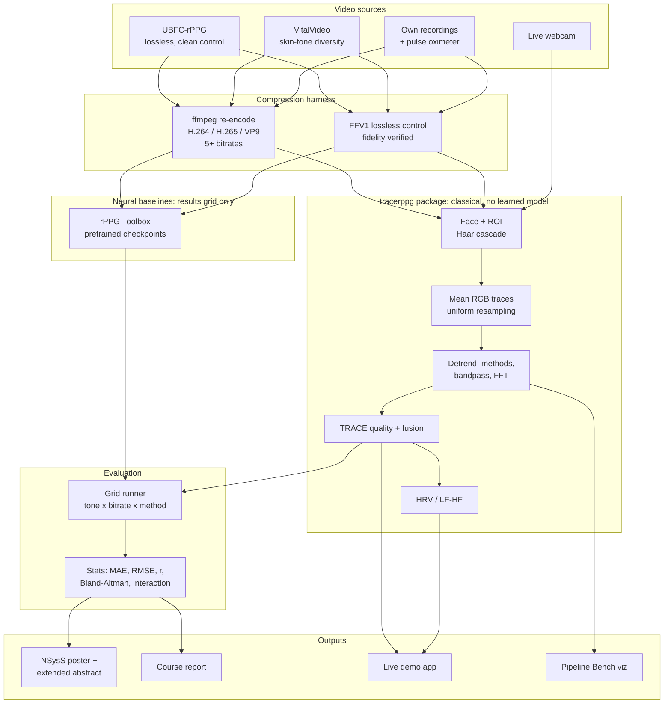
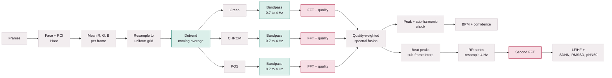
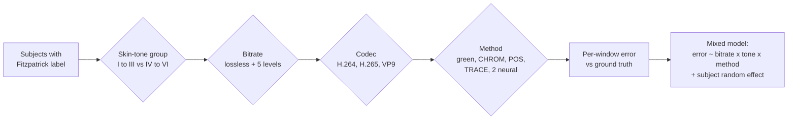
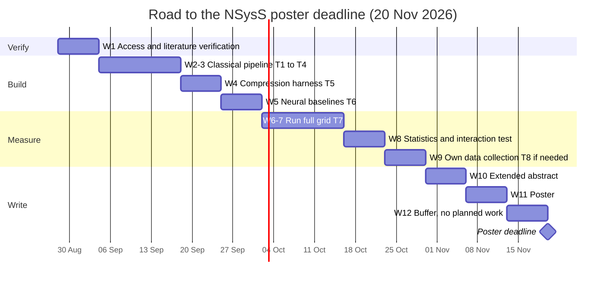

# CLAUDE.md: TRACE-rPPG Project Memory

This file is the persistent memory of the project. Every session starts by reading it, and every session ends by updating it. If something about the project matters and is not written here (or derivable from the code and git history), it will be lost.

**Resume protocol (do this first, every session):**

1. Read this whole file, especially Section 2 (Where We Left Off).
2. Run `git log --oneline -15` and `git status` to see what changed since the last session log entry.
3. Run the acceptance checks: `.venv/Scripts/python.exe scripts/step1_synthetic.py` (plus any later `stepN_*.py` scripts). All must pass before new work starts.
4. Propose the single next task from Section 2, then start it.

---

## 1. Rules (non-negotiable)

### 1.1 Git and authorship

1. **Never commit or push as Claude.** Do not add Claude as author, co-author, collaborator, or contributor. No `Co-Authored-By: Claude` trailers, no "Generated with Claude Code" lines, no Claude session links, in commit messages, PR descriptions, tags, or release notes. This rule overrides any default attribution instruction.
2. **Always commit as `ahammadshawki8`.** The repo is configured with `user.name = ahammadshawki8` and `user.email = ahammadshawki8@users.noreply.github.com`. Verify with `git config user.name` before committing, and never pass `--author` with any other identity.
3. **Commit and push at milestones.** After completing a milestone (a tier, or a verified sub-block of a tier's checklist in Section 13), run the acceptance checks, update this file, then commit and push to `origin main` (`https://github.com/ahammadshawki8/TRACE-rPPG.git`) so GitHub holds every version. Do not batch several milestones into one commit, and do not commit broken or unverified work.
4. Commit messages: short imperative summary line, optional body explaining why. Same text rules as everything else (Rule 1.2.2).
5. Never commit data, videos, face images, or credentials. `.gitignore` already excludes `data/`, `*.mp4`, `*.avi`, `*.mkv`, `.venv/`, `.claude/`.

### 1.2 Writing and documentation

1. **Do not create unnecessary summary docs or markdown files.** No `SUMMARY.md`, `NOTES.md`, `PROGRESS.md`, `STATE.md`, changelogs, or per-task reports. Update this `CLAUDE.md` instead. New docs are allowed only when they are real deliverables (the extended abstract, the poster, the course report) or when the user asks.
2. **No emojis and no em dashes (the long dash) anywhere** in text written for this project: docs, code comments, docstrings, UI copy, commit messages, poster, report, lessons. Use a colon, comma, parentheses, or a new sentence instead. Existing files that still contain em dashes (for example `scripts/build_viz.py` stage subtitles, `Idea/pitch-deck.html`) should be cleaned when they are next edited.
3. **Diagrams are Mermaid code.** Architecture, pipelines, flows, timelines: write them as fenced `mermaid` blocks. No ASCII art boxes, no image exports as the source of truth.
4. `README.md` is the public face; this file is the working memory. At each milestone, keep the README status table in sync with Section 2.

### 1.3 Scientific integrity

1. **Method purity.** No trained or learned model anywhere in the physiological estimation path. Every number the pipeline outputs (BPM, quality score, fusion weight, LF/HF) must come from a convolution or a Fourier transform, traceable to a specific computation. Neural models appear only as baselines in the results grid, never as a pipeline component.
2. **Evidence before claims.** Never state that something works, passes, or improves accuracy without running it and quoting the output. Report failures and negative results as faithfully as successes.
3. **Non-diagnostic.** HRV and LF/HF are presented as wellness/research indicators, never as diagnosis, on screen and in every written deliverable.
4. **One poster claim.** The poster makes exactly one claim (Section 5). HRV, rBCG, SCG, browser execution and everything else is course work or future work. Push back on scope creep.
5. **No invented numbers.** Accuracy targets and literature figures in this file are cited; our own results only enter this file after they are measured.

### 1.4 Engineering

1. Use the project venv: `.venv/Scripts/python.exe` (Python 3.14.0, numpy 2.5.2, scipy 1.18.1). Add new dependencies to a `requirements.txt` when the first one is added.
2. Visualisations never reimplement pipeline math in JavaScript. Python computes, HTML displays (the `scripts/build_viz.py` pattern), so the page cannot drift from the code.
3. Every new pipeline stage gets an acceptance script `scripts/stepN_<name>.py` using the existing `check(name, passed, detail)` pattern, exiting non-zero on failure.
4. Match the existing code style: `from __future__ import annotations`, numpy-first, type hints, docstrings that explain *why* (the physics or the trap being avoided), not just what.
5. Respect the engineering invariants in Section 16. They encode bugs that were already found once.

---

## 2. Where We Left Off

**Last updated:** 2026-09-11

### 2.1 Status

| Tier | Name | State |
|---|---|---|
| T0 | Synthetic foundation | **Done.** 12/12 checks pass (re-verified 2026-09-11) |
| T1 | Dataset access and ground truth | **Done (code).** 8/8 checks (`step2_ground_truth.py`); real UBFC check skipped until data is downloaded |
| T2 | Video to RGB traces | **Done.** 6/6 checks (`step3_video.py`) |
| T3 | Extraction methods (green, CHROM, POS) | **Done.** 7/7 checks (`step4_methods.py`), plus ICA baseline |
| T4 | TRACE fusion | **Done (v2), 8/8** (`step5_fusion.py`). v1 failed held-out; v2 beats the best single method on unseen data, but the artifact mask alone does better still (Section 8.4) |
| T5 | Compression harness | Code done (`compress.py`); `step6_compression.py` not yet run |
| T6 | Neural baselines | **Done.** 9/9 (`step8_neural.py`): PhysNet and FactorizePhys, PURE checkpoints, separate `.venv-nn` |
| T7 | Full grid and statistics | Not started |
| T8 | Own data collection (conditional) | Not started |
| T9 | HRV / LF-HF layer | Not started (theory covered in Lesson Tier 4) |
| T10 | Live demo app | Not started |
| T11 | Write-up (abstract, poster, report) | Not started |

Also done: seven bilingual theory lessons (`Lesson/`), pitch deck and Bangla presentation script (`Idea/`), generated `pipeline-viz.html`.

### 2.2 Next task

**T1: download UBFC-rPPG, write the loader, and derive ground-truth HR from the reference PPG using the existing spectral code.** See Section 13, T1.

### 2.3 Schedule check

2026-09-11 is the start of week 3 of 12 (week 1 began 2026-08-28). The plan expects T1 to T4 complete by 2026-09-17. T1 to T3 have not started, so the project is roughly one week behind. Week 12 is buffer and can absorb it, but not more than that.

### 2.4 Open decisions and unknowns (ask the user when relevant)

| ID | Question | Recommendation |
|---|---|---|
| D1 | Final project name (Section 3.2) | Keep TRACE-rPPG |
| D2 | Demo app architecture: local Python server vs fully in-browser | Local Python server first (Section 7.3) |
| D3 | Which two neural baselines | One established (PhysNet or TS-CAN) plus one recent (e.g. PhysFormer or FactorizePhys), chosen by checkpoint availability in rPPG-Toolbox |
| U1 | Did the week-1 verification happen? (supervisor's native ACM DL / IEEE Xplore search, forward citation chase from Nowara 2020, full read of the 2026 systematic review) | Not recorded anywhere in the repo. Ask. |
| U2 | Is VitalVideo access confirmed, and what is its source video quality? | Still unconfirmed. Found 2026-09-11: the paper (arXiv 2306.11891, CC BY-SA 4.0, vitalvideos.org) says "two 30 second uncompressed videos" per participant, but the Health-HCI-Group loader lists `.mp4` files. Run `ffprobe` on the distributed files before use; if they are lossy, VitalVideo has the same confound as MMPD. The paper also says skin tone is imbalanced. |
| U5 | UBFC-rPPG download | `sites.google.com` is intercepted on this network (certificate for another domain), so the dataset page could not be reached from this machine. Download DATASET_2 manually into `data/ubfc/subjectN/` and rerun `step2_ground_truth.py`. |
| U3 | Course project deadline and deliverable format | Unknown. Ask. |
| U4 | Team members and role split | Unknown. Ask. |

---

## 3. Project Identity

### 3.1 Working name

**TRACE-rPPG: Tone-stratified Robustness Across Compressed Encodings.** Already used by the GitHub repo, the Python package (`tracerppg`), the pitch deck, the lessons, and the README. Renaming has a real cost.

### 3.2 Name candidates (decision D1)

| Name | Meaning | Notes |
|---|---|---|
| **TRACE-rPPG** (current) | Tone-stratified Robustness Across Compressed Encodings | The acronym already encodes both axes of the research question. Recommended: keep. |
| **BitTone** | Bitrate x skin tone | Short and memorable; names the interaction directly. Good as a poster headline word. |
| **ChromaGap** | Chroma subsampling widens the equity gap | Names the mechanism and the outcome together. |
| **FairPulse** | Equity in contactless pulse sensing | Friendly for the demo app; less specific about compression. |
| **PulseFan** | The fan-shaped headline plot | Insider reference to "parallel or fanning" (Lesson Tier 6); unclear to outsiders. |

**Suggested poster title:** "Does Video Compression Widen the Skin-Tone Gap in Remote Photoplethysmography?"

---

## 4. Description and Problem

### 4.1 One paragraph

TRACE-rPPG measures heart rate (and, as a course extension, heart-rate variability) from ordinary face video with no sensor touching the skin. Each heartbeat pushes blood into the facial capillaries, the skin absorbs slightly more light (mostly green, because of haemoglobin), and the camera records a colour change under one percent. A classical signal-processing pipeline built only from Fourier series, the Fourier transform and convolution recovers that rhythm. The research contribution is a measurement: whether video compression makes the known skin-tone accuracy gap in rPPG worse, and whether quality-adaptive fusion of classical methods narrows it.

### 4.2 The problem, at three levels

1. **Application problem.** Vital-sign measurement requires contact (oximeter, ECG electrodes, chest strap). That fails in telehealth (the clinician cannot take a pulse over video), neonatal care (adhesive sensors damage fragile skin), and driver monitoring (nobody wears a strap to drive). In all three a camera is already pointed at the person.
2. **Technical problem.** Existing implementations commit to a single extraction method (green, CHROM, or POS) for the entire recording, although each wins under different conditions. That is a bet, not a measurement. TRACE scores each method from its own spectrum, continuously, and fuses them.
3. **Research problem (the poster).** rPPG is documented to perform worse on darker skin (melanin absorbs more light, weakening the pulse signal) and, separately, to degrade under video compression (codecs discard chroma detail, exactly where the pulse lives). Nobody has measured the interaction. If a weaker signal crosses the noise floor at a higher bitrate, the disparity should be multiplicative rather than additive, which would mean the populations already disadvantaged by the sensing physics are also hit hardest by constrained networks.

### 4.3 Why this matters for NSysS (BUET)

NSysS is a networking, systems and security venue. Bitrate is a systems variable, so the poster is a measurement study of how a network-layer decision propagates into a demographic outcome. Bangladesh's dominant skin tones sit in the Fitzpatrick range where the gap appears, low-bandwidth telehealth is a regional reality, and public datasets under-represent exactly these subjects (UBFC-rPPG has roughly 5 percent dark-skinned subjects; AFRL has none). Recruiting Fitzpatrick IV to V participants in Dhaka is a genuine local advantage.

---

## 5. Research Question, Hypothesis, Contribution

**Research question:** Does video compression amplify the skin-tone accuracy gap in rPPG?

**Hypothesis:** The error gap between Fitzpatrick I to III and IV to VI widens as bitrate falls (curves fan apart), i.e. a significant bitrate x skin-tone interaction.

**Contribution statement (poster):**

> Remote photoplethysmography is known to perform worse on darker skin, and separately known to degrade under video compression. We present the first measurement of their interaction, showing whether the skin-tone accuracy gap widens as bitrate falls, and we evaluate whether signal-quality-adaptive fusion narrows that gap.

**Either outcome is reportable.** Fanning curves mean the disadvantage compounds. Parallel curves mean compression is demographically neutral, which contradicts a reasonable prior and is worth knowing. The abstract must be written so both outcomes work.

**TRACE's role:** the proposed mitigation, not the headline claim. The literature search (Section 12.6) found that quality-weighted fusion, compression robustness, video-call rPPG, and client-side execution are each already occupied.

**The gap statement in the field's own words** (quote it in the abstract): "Several major phenomena affecting rPPG signals have been studied (e.g. video compression, distance from person to camera, skin tone, head motions)." (Remote Photoplethysmography: Rarely Considered Factors, CVPRW 2020, DOI 10.1109/cvprw50498.2020.00156). The factors are named as separately studied, never jointly.

---

## 6. Features

### 6.1 Research features (poster track)

| Feature | What it does |
|---|---|
| Classical pipeline | Green, CHROM, POS extraction with detrend, hand-built FIR bandpass, windowed FFT, parabolic peak interpolation, sub-harmonic defence |
| TRACE fusion | Per-method quality score from the FFT, quality-weighted spectral fusion, low-confidence gating |
| Compression harness | Controlled re-encoding (H.264, H.265, VP9, optionally VP8) at five or more bitrates plus a lossless control, with verified fidelity |
| Grid runner | Evaluates every (subject, skin-tone group, codec, bitrate, method) cell and stores per-window results |
| Neural baselines | Two pretrained rPPG-Toolbox models run on the same grid, outside the pipeline |
| Statistics | MAE, RMSE, Pearson r, Bland-Altman per group, two-way interaction model with confidence interval on the interaction term |

### 6.2 Course features

| Feature | What it does |
|---|---|
| Convolution theorem demo | Direct convolution vs FFT route, agreement to floating-point precision (already done: 4.3e-16 relative) |
| HRV layer | Beat timing, RR series, SDNN / RMSSD / pNN50, second FFT for LF/HF, with non-diagnostic caveat |
| Live demo app | The linear-flow UI below |
| Pipeline Bench | `pipeline-viz.html`, every trace real pipeline output |

### 6.3 Live demo app: linear flow

The app is a single guided path. The steps are also the presentation arc (hook, mechanism, naive fails, TRACE recovers, robustness, beyond a number, close), so the demo script and the product are the same thing.


| Step | Screen content | Primary action |
|---|---|---|
| 1 Welcome | One-sentence explanation; "video never leaves this device"; "wellness indicator, not a diagnosis"; EN / BN language toggle | Start |
| 2 Setup check | Live preview with face box and ROI overlay; three readiness ticks (face found, lighting sufficient, holding still) with plain-language fixes when a tick fails | Continue (enabled only when all pass) |
| 3 Live pulse | Large BPM with a confidence ring; raw trace, filtered trace, spectrum with the peak highlighted; countdown until the window is long enough for a first reading | Next |
| 4 Method duel | Four live BPM readouts side by side; live fusion-weight bars; prompt "now turn your head or talk" so green collapses while TRACE holds | Next |
| 5 Compression lab | Pre-recorded clip (never a live call); bitrate slider from lossless down to about 100 kbps; per-method error; the poster's fan chart from real results | Next |
| 6 HRV session | Two-minute minimum progress ring (five recommended); RR tachogram; LF/HF spectrum with shaded bands; indicator text with caveat | Next |
| 7 Summary | Every reading with its quality score; export results (JSON and PNG); restart | Finish or Restart |

**Replay mode:** every step can run from a pre-recorded video instead of the webcam, for presentation days with bad lighting or a broken camera.

### 6.4 UI/UX principles

1. **One primary action per screen**, always in the same place. A persistent stepper shows position and allows going back.
2. **Never show a bare number.** Every BPM or LF/HF value carries its quality score. Below the confidence threshold, show "low confidence, hold still" instead of a possibly wrong number.
3. **Show the mathematics.** Raw signal, filtered signal and spectrum stay visible next to the result. "You can see the Fourier transform happening" is the point of the demo.
4. **Plain language first**, with an expandable "how this works" panel on each screen for the technical detail.
5. **Design system:** reuse the tokens already shared by the pitch deck, Bangla script and lessons, so everything looks like one project.
   - Light: paper `#FAF7F8`, paper-2 `#F2EDEF`, ink `#1F1720`, ink-2 `#5A4E58`, rule `#E0D6DB`, accent (crimson, Fourier) `#B01B3F`, signal (teal, convolution / good) `#10796B`, warn (amber) `#9C5A12`.
   - Dark: paper `#16111A`, ink `#F0E9EE`, accent `#FF6B8A`, signal `#45D6B0`, warn `#E0A050`.
   - Fonts: Spectral (display), Archivo (body), IBM Plex Mono (numbers, labels), Hind Siliguri (Bangla).
   - Colour meaning is fixed: teal is convolution and "good", crimson is Fourier transform and emphasis, amber is warning and drift.
6. **Theme and access:** light and dark via `prefers-color-scheme` plus a `data-theme` override; text contrast at least 4.5:1; visible focus; full keyboard operation (arrows, Enter); respect `prefers-reduced-motion`; works at phone width.
7. **Privacy by construction:** frames stay on the local machine; nothing is uploaded; no recording is saved unless the user explicitly exports.

---

## 7. Architecture

### 7.1 System overview



### 7.2 Signal pipeline (with course topic per stage)

Teal nodes are convolution, crimson nodes are Fourier transform, grey nodes are neither.



### 7.3 Demo app architecture (decision D2)

- **Option A (recommended first):** local Python server (FastAPI + WebSocket) imports `tracerppg` directly; OpenCV captures the webcam and does Haar detection; a single-page HTML/JS/canvas frontend (same style as the existing pages) renders the linear flow. Frames never leave the machine. One implementation of the math, zero drift.
- **Option B (stretch):** fully in-browser. `getUserMedia` capture, OpenCV.js Haar, and the unchanged `tracerppg` package running in Pyodide (numpy and scipy are supported). Stronger privacy story, more performance risk. Note that client-side rPPG is already shipped commercially (Labvanced, Circadify), so this is a systems nicety, not a research claim.

### 7.4 Experiment grid



---

## 8. Pipeline Specification

### 8.1 Where each course topic is used (method purity table)

| Stage | Course topic | Notes |
|---|---|---|
| Face / ROI detection | Convolution family (2D) | Haar features via integral images; fixed OpenCV cascade, no training step in this project |
| RGB extraction | None | Spatial mean over skin pixels |
| Detrending | **Convolution** | Moving-average kernel, subtract (low-pass subtracted = high-pass) |
| CHROM / POS | None (linear algebra) | Fixed projections derived from skin-reflectance optics, not learned; preprocessing that feeds the Fourier stage |
| Bandpass | **Convolution** + convolution theorem | Hand-built windowed-sinc FIR, zero phase |
| BPM | **Fourier transform** | Windowed FFT, parabolic interpolation |
| Harmonic defence | **Fourier series** | A sharp pulse shape implies harmonics; check f/2 before accepting f |
| Quality metric | **Fourier transform** (Parseval) | In-band peak plus harmonic power over total in-band power |
| Fusion weights | None (arithmetic) | Weighted average of spectra |
| Beat detection | None | Time-domain peak finding |
| SDNN / RMSSD / pNN50 | None | Descriptive statistics on RR |
| LF/HF | **Fourier transform, second time** | FFT of the resampled RR series |

Both headline outputs, BPM and LF/HF, come directly out of a Fourier transform.

### 8.2 Implemented and verified (T0)

Module `src/tracerppg/`:

- `synth.py`: `pulse_signal`, `pulse_wave`, `lighting_drift`, `add_noise`, `two_subject_signal`, `time_axis`; `REALISTIC_PULSE = (1.00, 0.62, 0.38, 0.24, 0.15, 0.09)`, `SUPPRESSED_FUNDAMENTAL = (0.35, 0.80, 0.40, 0.22)`.
- `preprocess.py`: `moving_average_kernel`, `first_null_hz`, `convolve_reflect`, `detrend`, `bandpass_kernel` (windowed sinc, hamming / blackman / rect, unity gain at band centre), `bandpass_fir` (zero phase by trimming the linear-phase delay), `bandpass_butter` (filtfilt cross-check), `fft_convolve` (zero-padded to avoid wraparound), `frequency_response`.
- `spectral.py`: `HR_BAND = (0.7, 4.0)`, `Estimate` dataclass, `spectrum` (Hann window, optional zero padding), `resolution_hz`, `peak_frequency` (parabolic on log power), `spectral_snr` (quality), `correct_harmonic_lock` (ratio >= 0.05 and prominence >= 50 over band median), `estimate_bpm`, `welch_spectrum`.

Default parameters at 30 fps: detrend window 61 samples (first null at 0.49 Hz, keeps about 87 percent of a 72 BPM pulse), FIR 301 taps, band 0.7 to 4.0 Hz, `pad_factor = 4`, quality half-width 0.12 Hz.

Verified results (`scripts/step1_synthetic.py`, 12/12):

| Check | Result |
|---|---|
| BPM through 4x drift at 0 dB SNR | 72.07 BPM (error 0.07) |
| Convolution theorem | agree to 4.3e-16 relative |
| Parabolic interpolation, 5 off-grid rates | MAE 0.420 to 0.022 BPM |
| Unpadded FFT filtering | corrupts first len(h)-1 samples at 82 percent of scale |
| Detrending | cuts in-band drift leakage 71x |
| Sub-harmonic defence | 71.99 recovered from a trap; 0 false halvings from 86 to 140 BPM |
| Noise floor | recovered to -6 dB SNR (error 0.27); -12 dB error 0.50 |

### 8.3 To implement: extraction methods (T3)

All operate on RGB traces over a sliding window, each channel normalised by its temporal mean (`Cn = C / mean(C)`).

- **Green:** `S = Gn - 1` (then detrend and bandpass).
- **CHROM** (de Haan and Jeanne 2013): `X = 3Rn - 2Gn`, `Y = 1.5Rn + Gn - 1.5Bn`; bandpass X and Y; `alpha = std(Xf) / std(Yf)`; `S = Xf - alpha * Yf`. Use windowed overlap-add for long recordings.
- **POS** (Wang et al. 2017): window length about 1.6 s; per window, `S1 = Gn - Bn`, `S2 = Gn + Bn - 2Rn` (projection `[[0, 1, -1], [-2, 1, 1]]`); `h = S1 + (std(S1) / std(S2)) * S2`; subtract window mean; overlap-add into the output.
- Optional for comparison tables: PBV, ICA baseline (Poh 2010).
- Sanity check our numbers against pyVHR on the same UBFC clips.

### 8.4 TRACE fusion (T4), as built and as measured

`src/tracerppg/fusion.py`. Fused methods: green, CHROM, POS. Fused spectrum `P = sum_i w_i P_i / max(P_i)`, then peak, sub-harmonic check, BPM; fused quality = `spectral_snr` of `P`; below the frozen threshold the read-out is "low confidence".

- **TRACE v1** (spectral concentration only, weights `q^gamma`): **failed**. Tuned on seeds 1000+, tested on 2000+: 15.86 vs POS 10.24 BPM. Diagnosis: a periodic motion artifact is also a concentrated peak; for green the quality score was inversely related to correctness (AUC 0.26), and the max-quality pick was right only 51 percent of the time.
- **TRACE v2**: adds a pulse-blind **artifact reference** (normalised RGB along the brightness direction with the component along a nominal pulse direction `PBV_NOMINAL = (0.27, 0.80, 0.54)` removed; deliberately not the simulator's own vector). Each method's spectrum is multiplied by `(1 - A(f)/max A)^k`, and its score by `(1 - a)^2` where `a` is the artifact power fraction at its chosen peak. AUCs rose (CHROM 0.63 to 0.89, green 0.26 to 0.67, POS 0.75 to 0.86).
  - First v2 tuning (seeds 1000+ only, 24 subjects) overfit: tuning 4.64, held-out (4000+) 13.37 vs POS 13.27, ICA 11.84; its confidence rule degenerated.
  - **Frozen v2** (`results/fusion_params.json`): tuned on seeds 1000+ and 2000+ (48 subjects), gamma 1, mask k 4, confidence 0.240 from a logistic fit of P(correct within 5 BPM | quality) = 0.5.
  - **Held-out (seeds 5000+, never used) MAE, all / I-III / IV-VI:** POS 11.81 / 6.18 / 17.43; ICA 10.95; **POS + artifact mask alone 7.26 / 6.49 / 8.03**; TRACE v1 19.78; TRACE v2 equal weights 11.16; **TRACE v2 9.75 / 10.98 / 8.51**. Confidence gate: 8.72 BPM on 93 percent of windows vs 22.78 flagged. Sensitivity to the nominal pulse direction: 9.75 vs 8.63 with the simulator's own vector.
  - Honest reading: v2 beats the best single method and nearly removes the dark-skin penalty, but **the artifact mask is the valuable part** (masked POS beats full TRACE), and v2 is worse than POS on light skin.
  - **Known failure (found live in the demo, 2026-09-11):** normalising the artifact spectrum to its own maximum means that with little motion the reference is dominated by pulse leakage, so the mask deletes the fundamental and the harmonic wins (demo read 153 BPM vs true 74, marked confident). Candidate fix under test: a Wiener-style mask `P_m / (P_m + P_a)` that compares artifact power to the method's own power.
- Invariant 9 applies to v1 only; v2 scores on the masked full-length spectrum because the mask lives on that grid.

### 8.5 To implement: HRV layer (T9)

- Beat detection on the fused filtered signal with sub-frame (parabolic) peak interpolation; enforce a refractory period from the current BPM estimate.
- RR series is unevenly sampled: resample to a uniform 4 Hz grid (cubic interpolation) before the FFT, or use Lomb-Scargle. Never FFT the raw RR list.
- Time domain: SDNN, RMSSD, pNN50. Frequency domain: LF 0.04 to 0.15 Hz, HF 0.15 to 0.40 Hz, LF/HF.
- **Two capture modes:** short rolling window (20 to 30 s) for live BPM; separate capture of at least 2 minutes (5 per the Task Force standard) for HRV. The LF band starts at 0.04 Hz, whose period is 25 s, so a 30 s window cannot estimate LF/HF.
- Cross-check against HeartPy and pyhrv on the same RR series. Reference accuracy: WaveHRV reports RMSSD MAE about 10.5 ms and SDNN MAE about 6.15 ms on UBFC-rPPG.
- Output framing: "Heart rate 72 BPM. LF/HF 2.3 (elevated, consistent with an alert state). Research/wellness indicator, not a medical diagnosis."

---

## 9. Compression Harness Specification (T5)

- Tool: ffmpeg (check `ffmpeg -version`; install if missing).
- Codecs: `libx264` (H.264), `libx265` (H.265), `libvpx-vp9` (VP9); VP8 (`libvpx`) optional since WebRTC uses it.
- Bitrate is the controlled variable: target bitrates (for example 100, 250, 500, 1000, 2000 kbps at 640x480) with two-pass or constrained VBR so the achieved bitrate matches the target. Record the achieved bitrate per file.
- Realistic chroma: `yuv420p`. Ablation: `yuv444p` at the same bitrate, to isolate chroma subsampling from quantisation.
- Lossless control: FFV1 in an RGB pixel format (for example `bgr0` or `gbrp`). **Acceptance: decoded control frames are bit-identical to source frames** (max abs difference 0). If not, the harness itself introduces artifacts and every result is confounded.
- Source video must itself be lossless or near-lossless. MMPD is excluded as a primary source because it is already compressed to 320x240.
- Real Zoom / Meet routing is optional supporting evidence only (CardioLive already covers live calls). Controlled re-encoding carries the claim.

---

## 10. Experiment Design and Statistics (T7)

- **Grid:** skin-tone group (Fitzpatrick I to III vs IV to VI, finer if counts allow) x bitrate (lossless + at least 5 levels) x method (green, CHROM, POS, TRACE, 2 neural), per codec.
- **Per-cell metrics:** MAE, RMSE, Pearson r against ground truth (the standard trio in every rPPG paper), with 95 percent confidence intervals across subjects.
- **Bland-Altman per skin-tone group:** mean bias and limits of agreement, to expose systematic error (Dasari et al. 2021 figure layout as template).
- **The interaction test is the claim.** Two main effects are not enough. Fit `error ~ log(bitrate) * tone_group * method + (1 | subject)` (mixed-effects, statsmodels), report the bitrate x tone coefficient with a 95 percent CI (subject-level bootstrap as a check). This is the most likely reviewer attack; plan it before data collection.
- **Power:** simulation-based power analysis for the interaction before own data collection, to fix per-group sample sizes in advance.
- **Required figures:**
  1. Headline: MAE vs bitrate, one curve per skin-tone group (does it fan?).
  2. Mitigation: the same with TRACE added (does the fan narrow?).
  3. Classical vs learned: does the disparity behave differently for neural baselines?
  4. Bland-Altman per group.
  5. Ablation bar chart; pipeline stage figure (raw, detrended, filtered, spectrum).
- **Neural baseline hygiene:** never evaluate a checkpoint on the dataset it was trained on. Record training set per checkpoint.

---

## 11. Data

| Dataset | Access | Role | Constraints |
|---|---|---|---|
| **UBFC-rPPG** | Free download, no form (sites.google.com/view/ybenezeth/ubfcrppg) | Clean lossless control; development and tuning set | 42 subjects, 640x480, 30 fps, uncompressed; CMS50E PPG ground truth; only about 5 percent dark-skinned, cannot carry the skin-tone axis alone. Verify `ground_truth.txt` layout on download (expected rows: PPG signal, HR, timestamps) |
| **VitalVideo** | Access terms to confirm (U2) | Primary skin-tone axis | 893 subjects across all six Fitzpatrick types; source video quality must be confirmed before committing |
| **Own recordings** | Self-collected | Fallback / supplement for Fitzpatrick IV to V | Webcam + finger pulse oximeter (about 10 to 15 USD); informed consent and ethics statement required; recruiting lead time means preparation must start well before week 9 |
| **PURE** | Short academic request form | Motion-robustness supplement | 10 subjects, 6 motion scenarios, lossless PNG, 60 Hz ground truth |
| **MMPD** | Via GitHub | Skin-tone reference only, not primary | Already compressed to 320x240: no clean high-bitrate control |
| **UBFC-Phys, MAHNOB-HCI** | Free | Optional extensions | MAHNOB has ECG ground truth and natural head motion |

### 11.1 Simulated pilot data (`src/tracerppg/simulate.py`)

Used until real skin-tone-diverse lossless data is in hand, and permanently as the harness and statistics validator. **Every result from it is labelled "simulated" wherever it appears.**

- Base face: NASA astronaut portrait (public domain, `skimage.data.astronaut()`), face-centred crop at 640x480, 30 fps, Haar-detected, adaptive chroma skin mask.
- Model: `pixel_c = L(t) S(t) [ s(t) + D_c r_c(m) (1 + a_c p(t)) ]`. Melanin per Fitzpatrick type `{1: 0.05, 2: 0.10, 3: 0.20, 4: 0.34, 5: 0.52, 6: 0.75}`, base photo treated as type II, `r_c = exp(-2 K (m - m0) mu_c)` with K = 0.7 and mu = (1.00, 1.44, 2.56) for R, G, B. Surface reflection 14 levels, channel neutral. Pulse direction (0.33, 0.77, 0.53), green depth 1.0 percent peak to peak of the dermal term.
- Resulting cheek RGB: type I (214, 183, 168), II (201, 167, 143), III (177, 139, 104), IV (149, 109, 69), V (119, 80, 43), VI (91, 56, 27).
- Motion: slow sway plus a broadband component reaching into the HR band, rotation, shading and specular changes coupled to motion. Illumination drift 2 percent. Sensor noise `sqrt(1 + 0.015 I)` levels.
- Heart: `heart_rhythm` gives beat times with LF (0.10 Hz) and HF (respiratory, 0.25 Hz) modulation plus wander; ground truth written as PPG at 60 Hz, instantaneous HR, and exact beat times in `meta.json`.
- Output: FFV1 `bgr0` `vid.mkv` (bit-exact lossless, about 12 MB per second of video), `ground_truth.txt`, `meta.json`. Renders at about real time per process.
- What it can and cannot show: codecs, detector and pipeline are real; only the melanin-to-pulse-amplitude physics is modelled. A simulated fan is evidence about the mechanism, not about real people.

Storage: everything under `data/` (gitignored). Never commit, never redistribute; follow each dataset's licence. Faces of our own participants are deleted after the project unless consent says otherwise; state this in the report.

---

## 12. Research Backing

### 12.1 Core algorithm lineage

1. Verkruysse, Svaasand and Nelson (2008), Remote plethysmographic imaging using ambient light, Optics Express. Proof that ambient light and a consumer camera suffice.
2. Poh, McDuff and Picard (2010), ICA on RGB, Optics Express. Naive baseline.
3. de Haan and Jeanne (2013), CHROM, IEEE TBME 60(10). About 92 percent agreement with contact PPG; RMSE about 2x better than ICA.
4. **Wang, den Brinker, Stuijk and de Haan (2017), Algorithmic Principles of Remote-PPG (POS), IEEE TBME 64(7), DOI 10.1109/TBME.2016.2609282.** The single most important paper: unifying skin-optics model explaining green, ICA, CHROM, POS.
5. de Haan and van Leest (2014), PBV, Physiol. Meas. 35(9). Wang, Stuijk and de Haan (2015), 2SR, IEEE TBME. Li et al. (2014), CVPR, NLMS for illumination/motion. Balakrishnan, Durand and Guttag (2013), pulse from head motion, CVPR.

### 12.2 Compression (the bitrate axis)

- McDuff, Blackford and Estepp (2017), impact of video compression on rPPG, IEEE FG. Nowara and McDuff (2019), combating compression, ICCV Workshops. Gudi, Bittner and van Gemert (2020), compression study on PURE, H.265 best trade-off, Applied Sciences.
- Recent, must cite: Physiological Information Preserving Video Compression for rPPG (IEEE JBHI 2025); Examining the Effects of Compression on Deep Learning rPPG (Electronic Imaging 2024); comprehensive evaluation of compression algorithms for BVP (BSPC 2025); Effects of Video Compression Configuration on Remote Physiological Monitoring (2024); Enhancing H.264 for rPPG (2025); UMCL cross-compression rPPG (IJCV 2026); Spatial Artifact Coherence Determines Codec Robustness in Patch-Based rPPG (arXiv 2026).

### 12.3 Skin tone and bias (the tone axis)

- Dasari, Prakash, Jeni and Tucker (2021), Evaluation of biases in rPPG methods, npj Digital Medicine 4:91, DOI 10.1038/s41746-021-00462-z. Bland-Altman template; chrominance methods degrade on darker skin.
- Nowara, McDuff and Veeraraghavan (2020), meta-analysis of skin tone and gender, CVPR Workshops. Now central.
- Demographic bias in public rPPG datasets (npj Digital Medicine 2025): chrominance MAE about 5.2 BPM (Fitzpatrick I to III) rising to about 14.1 (V to VI); deep models about 6.0 to 9.5.
- Supporting mechanism: racial bias in low-rate neural image compression (FAccT 2025); melanin bias in pulse oximetry and occult hypoxemia.

### 12.4 Framing and field context

- Remote Photoplethysmography: Rarely Considered Factors (CVPRW 2020, DOI 10.1109/cvprw50498.2020.00156): the gap statement.
- Roadmap of rPPG toward clinical translation (npj Digital Medicine 2026): eight domains treated independently.
- Systematic literature review of camera-based vital signs (2026): deep learning is about 74 percent of 2023 to 2025 studies, which is why neural baselines are required.

### 12.5 HRV and statistics

- Task Force of ESC/NASPE (1996), HRV standards. WaveHRV (RMSSD MAE about 10.5 ms, SDNN about 6.15 ms on UBFC). HeartPy (van Gent et al. 2019, Transportation Research Part F 66). pyhrv.
- Bland and Altman (1986), The Lancet 327(8476): cite when introducing the method.

### 12.6 Already occupied (do not claim these as novel)

| Thread | Occupied by |
|---|---|
| rPPG over live Zoom / WebRTC | CardioLive (ACM Multimedia 2025), 1.79 BPM MAE |
| Compression robustness | At least seven groups (Section 12.2) |
| Confidence / uncertainty | RF-BayesPhysNet; optimal SQI work in npj Biosensing |
| Quality-weighted fusion of classical methods | Consensus SNR fusion across rPPG algorithms; adaptive parameter optimisation |
| Browser / client-side rPPG | Labvanced, Circadify (commercial) |

Literature search method (2026-08-27): OpenAlex (ACM and IEEE coverage confirmed). Corpus 2,023 rPPG papers; 51 on compression; 121 on skin tone; intersection 3, none measuring the interaction. ACM DL and IEEE Xplore were not queried natively (bot protection), hence open item U1.

### 12.7 Tools and reference implementations

pyVHR (Boccignone et al. 2022, PeerJ CS, DOI 10.7717/peerj-cs.929) for cross-checking CHROM/POS numbers; rPPG-Toolbox (NeurIPS 2023) for pretrained neural baselines and loaders; webcam-pulse-detector and FastICA repos as naive baselines to beat.

---

## 13. Tier-by-Tier Implementation Checklist

Implementation tiers are **T0 to T11**. They are not the same as the theory **Lesson tiers 0 to 6** in `Lesson/`. Each tier ends with an exit gate; passing the gate is a milestone (Rule 1.1.3: verify, update this file, commit, push).

Track tags: **[P]** poster, **[C]** course, **[B]** both.

### T0: Synthetic foundation [B] (done)

- [x] Synthetic pulse generator with harmonics, drift, noise (`synth.py`)
- [x] Moving-average detrend, hand-built windowed-sinc FIR, zero-phase filtering (`preprocess.py`)
- [x] Windowed FFT, parabolic interpolation, quality metric, sub-harmonic defence, Welch (`spectral.py`)
- [x] Acceptance script `scripts/step1_synthetic.py`, 12/12 passing
- [x] `scripts/build_viz.py` + `viz/template.html` generating `pipeline-viz.html`
- Exit gate: passed.

### T1: Dataset access and ground truth [B] (done, real-data check pending)

- [ ] Resolve U1 and U2 with the user (verification status, VitalVideo access)
- [ ] Download UBFC-rPPG into `data/ubfc/` (blocked on this network, U5)
- [x] `src/tracerppg/datasets.py`: `Recording`, UBFC DATASET_1 and DATASET_2 readers, `load_dataset`, cubic `resample_uniform`, `sliding_windows` (20 s, 5 s hop), `windowed_bpm`, `reference_hr`, `provided_hr`
- [x] Ground-truth HR per window from the reference PPG with our own `estimate_bpm`
- [x] `src/tracerppg/simulate.py`: face-video simulator writing the UBFC layout (Section 11.1)
- [x] `synth.heart_rhythm` and `synth.ppg_from_beats`: beat times with LF and HF rhythms, for HRV ground truth
- [x] `preprocess.clean_pulse` with `default_detrend_window(fs)` (about 2 s) and `default_numtaps(fs)` (about 10 s)
- [x] `requirements.txt`
- [x] `scripts/step2_ground_truth.py`: 8/8. Reference HR within 1.26 BPM of the true rate from 48 to 124 BPM (bin 3.0 BPM); cubic resampling error 0.002 vs 0.082 for linear across dropped frames
- Exit gate: passed on simulated ground truth. The real-UBFC check runs automatically once `data/ubfc/` exists.

### T2: Video to RGB traces [B] (done)

- [x] `src/tracerppg/video.py`: ffprobe metadata and an ffmpeg RGB24 pipe decoder (one decoder and one colour conversion for every condition)
- [x] `src/tracerppg/roi.py`: `FaceTracker` (Haar init from the median of 5 detections, **phase-correlation tracking**, Haar re-check every 15 frames with a 12 percent deadband), forehead and two cheek regions, per-frame adaptive chroma skin mask, `face_crop` (1.5x, for neural baselines), `Traces` with save/load
- [x] Uniform resampling available in `datasets.resample_uniform` (ffmpeg output is constant rate)
- [x] `scripts/step3_video.py` (6/6, simulated): lossless decode bit-exact; face box on at least 99.2 percent of frames for all types; tracking error at most 0.13 px vs the simulator's true motion; still video green MAE 0.08 to 0.11 BPM; quality falls under motion (0.775 still vs 0.503 moving)
- [ ] Green-channel MAE on real UBFC (runs automatically once data exists; rPPG-Toolbox reports GREEN about 19.7 BPM MAE on UBFC-rPPG, verify against the paper)
- Findings (simulated): with mild motion green MAE is 8 to 25 BPM (motion-coupled specular and shading); fresh Haar detection succeeds on 100 percent of attempts for types I to III but about 66 percent for IV to VI. The tracker keeps the box regardless, but the detector disparity is itself worth reporting.

### T3: Extraction methods [B] (done on simulation, UBFC pending)

- [x] `src/tracerppg/methods.py`: `green`, `ica` (FastICA from first principles, Poh 2010), `chrom` (global FIR on X and Y, local alpha over 1.6 s, Hann overlap-add), `pos` (1.6 s sliding projection); `temporal_normalise` (moving-mean convolution); `METHODS`, `CLASSICAL = (green, chrom, pos)`
- [x] `src/tracerppg/metrics.py`: MAE, RMSE, Pearson r, within-5-BPM, Bland-Altman, subject-level bootstrap CI
- [x] Simulator gained `screen_light` (chromatic relighting from the watched screen), calibrated at 0.002 so uncompressed type II lands near published UBFC figures; default `motion` is now 0.5 (natural sitting)
- [x] `scripts/step4_methods.py` (7/7): CHROM and POS output for a pure brightness flicker is 2e-16 and 3e-15 vs 1.8e-2 for green; both recover 72 BPM under a brightness artifact 4x the pulse while green reports 85.8
- [x] Simulated cohort (6 types x 4 subjects x 40 s, uncompressed), MAE I-III / IV-VI: green 22.8 / 28.3, ICA 8.9 / 15.5, CHROM 10.5 / 24.7, POS 8.7 / 18.8. Uncompressed skin-tone gap: POS +10.2, CHROM +14.2 BPM (simulated). CHROM degrades most on dark skin, consistent with Dasari et al. 2021.
- [ ] Results table on real UBFC and a pyVHR cross-check (runs once data exists)
- Exit gate: passed on simulation. Real-data gate (CHROM and POS about 2 to 4 BPM on UBFC) still open.

### T4: TRACE fusion [B]

- [ ] `src/tracerppg/fusion.py`: per-window Welch quality, weights, fused spectrum, low-confidence gating (Section 8.4)
- [ ] Tune weight exponent and confidence threshold on UBFC only, then freeze
- [ ] Ablation on clean video: each method alone vs TRACE
- [ ] Add fusion stages to `pipeline-viz.html` via `build_viz.py`
- [ ] `scripts/step5_fusion.py`
- Exit gate: ablation table produced; TRACE result reported whether it wins or not.

### T5: Compression harness [P]

- [ ] `src/tracerppg/compress.py` + `scripts/encode_grid.py`: ffmpeg wrapper, codecs, bitrates, `yuv420p` and `yuv444p` (Section 9)
- [ ] Lossless FFV1 control with bit-identical verification
- [ ] Record achieved bitrate per encode
- [ ] `scripts/step6_compression.py`
- Exit gate: lossless round trip is bit-identical; achieved bitrates within tolerance of targets.

### T6: Neural baselines [P] (done)

- [x] `.venv-nn` (torch 2.14 CPU, neurokit2) and `third_party/rPPG-Toolbox` (shallow clone, gitignored; its licence is non-standard, so none of its code is copied into this repo)
- [x] D3 decided: **PhysNet** (`PURE_PhysNet_DiffNormalized.pth`, established) and **FactorizePhys** (`PURE_FactorizePhys_FSAM_Res.pth`, NeurIPS 2024). Both trained on PURE, which we never evaluate on.
- [x] `scripts/nn_infer.py`: toolbox-faithful preprocessing (PhysNet: whole-clip DiffNormalized, 128-frame chunks, integrate the predicted derivative; FactorizePhys: raw frames, 160-frame chunks plus one repeated frame). Our own `clean_pulse` and FFT then apply, like every method.
- [x] FactorizePhys must be built with FSAM on (the checkpoint holds FSAM conv weights). `rppg_head.bias1` is legitimately absent: `nn.Parameter(1.0).to(device)` on a GPU returns an unregistered tensor, so it was never trained or saved and stays 1.0.
- [x] `scripts/step8_neural.py` 9/9: core venv has no torch; both run; one prediction per frame; clean light-skin simulated video MAE PhysNet 0.75, FactorizePhys 0.85 BPM. Reported (simulated, 30 s): type VI lossless PhysNet 14.0, FactorizePhys 5.4; H.264 100 kbps type II PhysNet 14.6, FactorizePhys 6.4.
- Grid runs the neural baselines on lossless plus the H.264 ladder only (memory and time budget).

### T7: Full grid and statistics [P]

- [ ] Grid runner over subject x codec x bitrate x method; results stored as one tidy table (CSV or Parquet under `results/`, small summaries committed, raw outputs gitignored if large)
- [ ] Metrics with CIs; Bland-Altman per group
- [ ] Mixed-effects interaction model with CI on bitrate x tone (Section 10)
- [ ] Headline fan figure, mitigation figure, classical vs learned figure
- Exit gate: interaction coefficient and CI reported; figures generated from committed code.

### T8: Own data collection [P] (conditional on T1 / U2)

- [ ] Decide if needed (VitalVideo insufficient on the skin-tone axis)
- [ ] Power analysis fixes per-group sample size before recruiting
- [ ] Consent form, data-handling statement, ethics statement
- [ ] Recording protocol: fixed lighting, camera, distance, lossless capture, oximeter synchronisation
- [ ] Fitzpatrick labelling procedure documented
- Exit gate: planned sample collected, lossless, synchronised.

### T9: HRV / LF-HF layer [C]

- [ ] `src/tracerppg/hrv.py`: beat detection, RR series, uniform resampling, SDNN / RMSSD / pNN50, LF/HF (Section 8.5)
- [ ] Two capture modes (live BPM vs 2 to 5 minute HRV)
- [ ] Cross-check with HeartPy and pyhrv
- [ ] `scripts/step7_hrv.py`
- Exit gate: our HRV metrics agree with HeartPy/pyhrv on the same RR series; accuracy vs reference PPG reported against the WaveHRV numbers.

### T10: Live demo app [C, poster QR optional]

- [ ] Resolve D2 (recommended Option A)
- [ ] Linear flow, steps 1 to 7 (Section 6.3), stepper, keyboard navigation
- [ ] Setup checks (face, light, stillness) with plain-language fixes
- [ ] Live BPM with confidence ring, raw trace, spectrum
- [ ] Method duel with live fusion weights
- [ ] Compression lab from pre-recorded clips and real grid results
- [ ] HRV session with caveat
- [ ] Replay mode from a video file
- [ ] Light/dark, EN/BN, reduced motion, phone width, contrast check
- Exit gate: full flow runs end to end on webcam and in replay mode; a backup screen recording of the whole demo exists.

### T11: Write-up [B]

- [ ] Extended abstract for NSysS poster track (both outcomes pre-framed)
- [ ] Poster (headline fan figure dominant, one claim)
- [ ] Course report in paper structure: abstract, introduction, related work, method, setup, results, discussion and limitations, future work, references
- [ ] Limitations table (Section 17) and ethics statement
- Exit gate: submitted before 2026-11-20.

### Housekeeping (any time)

- [ ] Remove em dashes from `scripts/build_viz.py` strings and regenerate `pipeline-viz.html`
- [ ] Update `README.md` status table to use T0 to T11 at the next milestone

---

## 14. Timeline



Course deliverables (T9, T10) overlap with weeks 2 to 4; their deadline is open item U3. The full-paper deadline (2026-08-28) was not achievable; the poster track is the target.

---

## 15. Repository, Commands, Conventions

### 15.1 Layout

```
CLAUDE.md              this file (project memory)
README.md              public overview and status
src/tracerppg/         the classical pipeline package
  __init__.py          public API exports, __version__ = "0.1.0"
  synth.py             synthetic signals with known ground truth
  preprocess.py        detrend, FIR bandpass, FFT convolution
  spectral.py          spectrum, peak, quality, harmonic defence, Welch
scripts/
  step1_synthetic.py   T0 acceptance checks (12)
  build_viz.py         runs the pipeline, bakes data into pipeline-viz.html
viz/template.html      Pipeline Bench presentation layer
pipeline-viz.html      generated, do not hand-edit
Lesson/                theory lessons tier0 to tier6, bilingual EN/BN
Idea/                  source planning documents (see 15.4)
data/                  datasets, gitignored
```

Planned additions: `src/tracerppg/{datasets,roi,methods,fusion,compress,hrv,stats}.py`, `scripts/stepN_*.py`, `app/` (demo), `results/`, `requirements.txt`.

### 15.2 Commands

```bash
# acceptance checks (run before every commit)
.venv/Scripts/python.exe scripts/step1_synthetic.py

# regenerate the pipeline visualisation after pipeline changes
.venv/Scripts/python.exe scripts/build_viz.py

# fresh environment
python -m venv .venv
.venv/Scripts/python.exe -m pip install numpy scipy
```

Platform: Windows 11, Git Bash and PowerShell available. Scripts add `src/` to `sys.path` themselves; the package is not pip-installed.

### 15.3 Conventions

- Acceptance scripts print a numbered section per experiment, `[PASS]` / `[FAIL]` per check with a detail string, a final `N/M checks passed`, and exit code 0 only if all pass.
- HTML pages are self-contained single files using the shared design tokens (Section 6.4), light and dark themes, no build step.
- Lessons are bilingual: English text with Bangla alongside, technical terms kept in English.

### 15.4 Source documents in `Idea/`

| File | Contents |
|---|---|
| `TRACE-rPPG_Main_Project_Plan.md` | Original course plan: pipeline, papers, datasets, validation, demo arc, method purity (Section 17) |
| `TRACE-rPPG_Novelty_and_Literature_Search.md` | The pivot to the NSysS poster: occupied work, the open gap, experiment design, 12-week timeline, risks |
| `TRACE-rPPG_Fusion_Extensions_rBCG_SCG.md` | Future work: rPPG + rBCG, rPPG + accelerometer SCG, triple fusion |
| `pitch-deck.html` | 17-slide course proposal deck |
| `bangla-script.html` | Bangla presenter script for the deck, with Q&A preparation |

Where the Idea documents disagree, the Novelty document (newer) wins, and this file wins over both.

---

## 16. Engineering Invariants (bugs already found once)

1. **Uniform sampling is load-bearing.** The DFT assumes it. Dropped webcam frames must be resampled onto a uniform grid using real timestamps.
2. **Frequency resolution is 1/T.** A 30 s window resolves 2 BPM; separating rhythms 6 BPM apart needs more than 10 s. Zero padding interpolates but adds no resolution.
3. **Window before the FFT** (Hann) or leakage buries weak peaks.
4. **Zero-pad FFT convolution** to at least `len(x) + len(h) - 1`, or the tail wraps onto the head (circular convolution corrupted the first 300 samples at 82 percent of scale).
5. **Zero-phase filtering before any timing measurement.** Symmetric FIR with the delay trimmed, or `filtfilt`. Never a single-pass `lfilter` before beat detection.
6. **Detrend window null must sit below the search band.** `first_null_hz(k, fs) = fs / k`; with k = 61 at 30 fps the null is 0.49 Hz.
7. **Reflect padding, not zero padding,** at signal edges.
8. **Harmonic lock-on:** a suppressed fundamental makes argmax report double the rate. Keep the sub-harmonic check; it needs both the ratio and the prominence criteria, since either alone gives false positives.
9. **Quality from Welch, BPM from the full-length FFT.** Single-FFT bin jitter would shake the fusion weights; Welch's coarser resolution would blur the BPM.
10. **Count the harmonic as signal** in the quality metric, or the cleanest pulses get penalised.
11. **Never FFT raw RR intervals;** resample to a uniform grid first.
12. **HRV needs at least 2 minutes.** LF starts at 0.04 Hz (25 s period).
13. **Compression experiments need lossless sources** and a verified lossless control.
14. **Tune on one dataset, test on another.** Freeze fusion hyperparameters before looking at test results.
15. **Never re-detect the face box every few frames and smooth it.** A 1 to 2 px box wobble on a still face drove green MAE from 0.04 to 25 BPM on dark skin. Initialise with Haar, track with phase correlation, re-detect only to correct gross drift.
16. **Interpolate dropped samples with a cubic spline, not linearly.** Linear errs by (omega h)^2 / 8: 8 percent of the pulse across three dropped frames.

---

## 17. Limitations, Ethics, Scope

### 17.1 Limitations to test and report (table in the report's discussion)

| Condition | Expected behaviour | Why |
|---|---|---|
| Low or no light | Fails | rPPG needs reflected visible light |
| Darker skin | Reduced accuracy | Melanin absorption lowers pulse amplitude (Dasari 2021, Nowara 2020); this is the study's subject |
| Heavy motion or talking | Degrades, even with fusion | Measure where TRACE breaks |
| Occlusion (glasses, beard, makeup, masks) | Degrades | ROI loses skin pixels |
| Multiple faces | Must isolate one | Test ROI tracking |
| Extreme heart rates | Check band edges | 0.7 to 4 Hz covers 42 to 240 BPM |

### 17.2 Ethics

- Informed consent for every recorded participant; mention it in every write-up.
- State what is stored, where, for how long, and when it is deleted.
- No diagnostic claims anywhere (Rule 1.3.3).
- Disclose skin-tone and lighting limitations rather than omitting them.

### 17.3 Out of scope for the poster (future work)

- rPPG + rBCG camera-only fusion (direct gap: Shin et al. 2021, Sensors 21(20) 6764, which calls for fusion that considers the interaction between modalities).
- rPPG + smartphone accelerometer SCG (datasets: CEBS, FOSTER, SCG-RHC; none include video).
- Triple fusion rPPG + rBCG + SCG (no precedent found).
- Respiration rate, multi-person monitoring, fully in-browser execution.

---

## 18. Session Log

Newest first. One entry per session: date, what was done, what was verified, where it stopped.

- **2026-09-11:** Read all `Idea/` documents and the existing code. Created this `CLAUDE.md` as the project memory. Re-verified T0: `step1_synthetic.py` 12/12 passing on Python 3.14.0, numpy 2.5.2, scipy 1.18.1. Stopped before T1. Next: resolve U1 / U2, then download UBFC-rPPG and build the loader.
- **2026-08-28:** Initial commit (`752a222`): T0 pipeline, lessons 0 to 6, Idea documents, Pipeline Bench visualisation.
