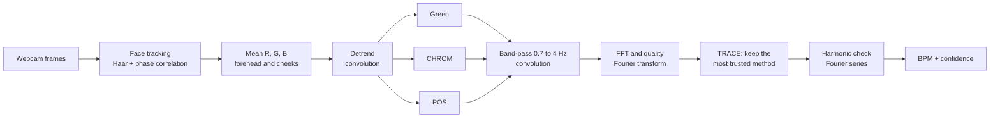

# TRACE rPPG

**Tone-stratified Robustness Across Compressed Encodings, remote photoplethysmography**

Heart rate from an ordinary webcam, with nothing touching the skin. Every
heartbeat pushes a little more blood into the face, the skin absorbs slightly
more green light, and the camera sees a colour change of less than one percent.
A classical signal-processing pipeline recovers that rhythm. It uses only
convolution, the Fourier transform and the Fourier series, and no trained
model anywhere in the path from pixels to BPM.

Authors: Ahammad Shawki and S. M. Abu Fayeem.

## The idea in one paragraph

There are three well-known ways to turn face colour into a pulse: **Green**
(Verkruysse 2008), **CHROM** (de Haan 2013) and **POS** (Wang 2017). Each one
fails in a different situation: Green is fooled by any brightness change, CHROM
suffers on darker skin, and POS can lose the pulse when motion looks like it.
Most systems pick one method and hope. **TRACE runs all three at once and,
every half second, keeps the one whose spectrum it trusts most.** Trust comes
from the spectrum itself: how much of the in-band power sits in one sharp peak
and its harmonic, after masking the frequencies where a pulse-blind motion
reference has power. When no method is trustworthy, TRACE says "low confidence"
instead of showing a number.

## Results so far

Simulated volunteers (skin types I to VI, 10 conditions: still, talking,
restless, dim, bright, flicker, screen glow, fast heart and more). TRACE was
tuned on one set of simulated people and tested once on a separate set it
had never seen (180 runs, 3,060 read-outs, true heart rate known exactly):

| Method | Mean error (BPM) |
|---|---|
| Green | 23.28 |
| CHROM | 17.02 |
| POS | 12.10 |
| **TRACE (dynamic selection)** | **9.95** |

- TRACE marks 87 percent of read-outs as confident; on those the error is
  5.33 BPM, against 40.11 BPM on the ones it flags. The confidence gate is
  doing real work.
- Harmonic mistakes (reading double or half the true rate) fell from 10.1 to
  5.9 percent of read-outs compared with the earlier weighted-average TRACE v2.
- Known weaknesses, reported rather than hidden: a glowing screen lighting the
  face defeats every method, and very fast heart rates got worse than with v2
  (5.1 to 13.0 BPM).

Real data is being added: a subset of **UBFC-rPPG** (contact pulse oximeter
reference) and **our own volunteers** recorded with a smartwatch reference.
The Scenarios screen in the app shows all three sources side by side as
soon as they exist. See `instructions.md` for how the data is collected.

These numbers are from simulation. The skin optics are modelled, but the
face tracker, the codecs and the pipeline are the real code.

## The app

```bash
.venv/Scripts/python.exe app/server.py      # then open http://127.0.0.1:8000
```

| Screen | What it shows |
|---|---|
| **Measure** | Live heart rate from your webcam or a simulated volunteer, a confidence ring, the pulse wave, and which method TRACE trusts right now |
| **Methods** | Green, CHROM and POS side by side with their formulas, live trust bars, and a simulator panel to change skin type, heart rate, motion and light while you watch trust move |
| **Collect** | Volunteer portal: consent, skin type, four 60 s clips per person, smartwatch readings at 0:20, 0:40 and 1:00, scored automatically |
| **Scenarios** | The results hub: simulated, UBFC-rPPG and real volunteers, each against its own reference |
| **What's next** | Beyond a number: telling a real face from a photo (prototype), heart rhythm, guided breathing, applications |
| **How it works** | A hand-drawn slide deck of the theory, with live data inside the "Go deeper" panels |

Frames never leave the computer. By default only the average skin colour of
the forehead and cheeks is stored, not the video. Nothing on screen is a
medical diagnosis.

## The pipeline



| Course topic | Where it is used |
|---|---|
| Convolution | Detrending (moving average), the hand-built windowed-sinc band-pass filter, the face tracker's phase correlation |
| Fourier transform | The spectrum that gives BPM, the quality score that drives TRACE, the second FFT of heart-rate variability |
| Fourier series | A real pulse has harmonics at 2f and 3f; TRACE checks f/2 before trusting a tall peak so it never reports double the rate |

## Quick start

```bash
python -m venv .venv
.venv/Scripts/python.exe -m pip install -r requirements.txt

# acceptance checks
.venv/Scripts/python.exe scripts/step1_synthetic.py      # the mathematics, 12 checks
.venv/Scripts/python.exe scripts/step4_methods.py        # Green, CHROM, POS
.venv/Scripts/python.exe scripts/step5_fusion.py         # TRACE fusion
.venv/Scripts/python.exe scripts/step10_simulator.py     # live simulator and scenarios
.venv/Scripts/python.exe scripts/step11_collect.py       # volunteer portal

# the simulated scenario sweep shown on the Scenarios screen
.venv/Scripts/python.exe scripts/sim_scenarios.py

# real recordings in the UBFC layout (may live on another drive)
set TRACE_UBFC_DIR=D:\datasets\ubfc
.venv/Scripts/python.exe scripts/step2_ground_truth.py   # the reference parses
.venv/Scripts/python.exe scripts/eval_real_fusion.py --dataset D:\datasets\ubfc
```

Requirements: Python 3.14, ffmpeg on the path, a webcam for live use.

## Layout

```
src/tracerppg/      the pipeline package
  preprocess.py       detrending, hand-built FIR, zero-phase filtering
  spectral.py         windowed FFT, interpolation, quality, harmonic defence
  methods.py          Green, ICA, CHROM, POS
  fusion.py           TRACE (v1, v2, v3)
  roi.py, video.py    face tracking and RGB traces
  simulate.py         face-video simulator with controllable skin, motion, light
  datasets.py         UBFC loaders and ground truth
  hrv.py              beats, RR intervals, SDNN, RMSSD, LF/HF
app/                FastAPI server, engine, volunteer portal, results hub, UI
scripts/            acceptance checks (stepN), tuning, sweeps, evaluation
results/            frozen parameters and result tables (raw data never committed)
```

`CLAUDE.md` is the detailed project memory with every measured number and
every failed attempt (TRACE v1 failed on held-out data; v2 lost to POS in the
live sweep; v3 is the version that holds up).

## Honest limits

- Results so far are simulated; real data is being collected.
- Low light, heavy motion and screen glow still defeat the method.
- Darker skin gives a fainter pulse. It is fainter, not gone, and we report
  error by skin type rather than one average.
- The photo-versus-face check is a prototype and not yet reliable.
- Heart rate and heart-rate variability here are wellness indicators, never a
  diagnosis.

## Data and licences

UBFC-rPPG: Bobbia et al., "Unsupervised skin tissue segmentation for remote
photoplethysmography", Pattern Recognition Letters, 2017. Used for research
only under its terms and never redistributed. Volunteer data stays on the
recording computer, is stored under a code rather than a name, and is deleted
on request or when the project ends.
