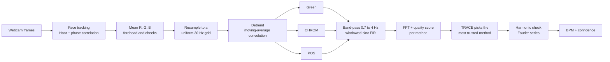
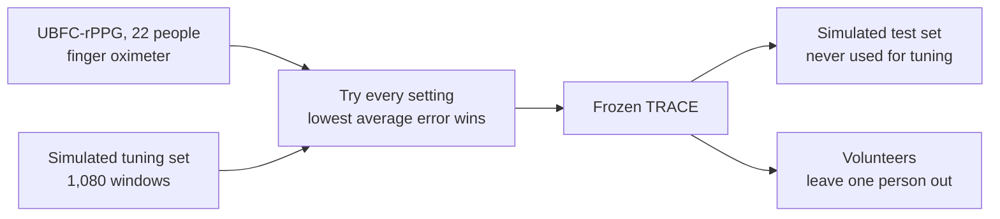

# TRACE rPPG

**Tone-stratified Robustness Across Compressed Encodings, remote photoplethysmography**

Heart rate from an ordinary webcam, with nothing touching the skin. Every
heartbeat pushes a little more blood into the face, the skin absorbs slightly
more green light, and the camera sees a colour change of less than one percent.
A classical signal-processing pipeline recovers that rhythm. It uses only
convolution, the Fourier transform and the Fourier series: no trained model
anywhere in the path from pixels to BPM.

- **Authors:** Ahammad Shawki (2305067) and S. M. Abu Fayeem (2305070)
- **Supervisor:** Anik Saha
- **Repository:** https://github.com/ahammadshawki8/TRACE-rPPG

---

## Contents

1. [The idea](#the-idea)
2. [Results at a glance](#results-at-a-glance)
3. [How the pipeline works](#how-the-pipeline-works)
4. [How TRACE chooses](#how-trace-chooses)
5. [How sure TRACE is](#how-sure-trace-is)
6. [How TRACE was tuned, fairly](#how-trace-was-tuned-fairly)
7. [Full results](#full-results)
8. [Classical against learned](#classical-against-learned)
9. [Where it fails, and why](#where-it-fails-and-why)
10. [The app](#the-app)
11. [Collecting volunteer data](#collecting-volunteer-data)
12. [Running it](#running-it)
13. [Repository layout](#repository-layout)
14. [Honest limits](#honest-limits)
15. [References and credits](#references-and-credits)

---

## The idea

There are three well-known ways to turn face colour into a pulse:

| Method | Source | Idea | Typical failure |
|---|---|---|---|
| **Green** | Verkruysse 2008 | Blood absorbs green light most, so use the green channel alone | Any brightness change (flicker, cloud, screen, motion shading) looks like a pulse |
| **CHROM** | de Haan and Jeanne 2013 | Subtract two colour differences that both cancel white light | Weaker on darker skin |
| **POS** | Wang et al. 2017 | Project the colour onto a plane at right angles to the person's own skin tone, re-aimed every 1.6 s | Can lose the pulse when motion or a room rhythm looks like it |

Most systems pick one method for the whole recording and hope. **TRACE runs all
three at once and, every half second, keeps the one whose spectrum it trusts
most.** Trust comes from the spectrum itself. When no method is trustworthy,
TRACE says "low confidence, hold still" instead of showing a number.

The course topics sit at the core:

| Course topic | Where it is used |
|---|---|
| **Convolution** | Detrending (moving average), the hand-built windowed-sinc band-pass filter, face tracking by phase correlation |
| **Fourier transform** | The spectrum that gives BPM; the quality score that drives TRACE (Parseval); the second FFT of heart-rate variability |
| **Fourier series** | A real pulse has harmonics at 2f and 3f, so TRACE checks f/2 before trusting a tall peak and never reports double the rate |

---

## Results at a glance

Mean absolute error in beats per minute against each source's reference; lower is better.

| Source | Reference | Size | Green | CHROM | POS | **TRACE** | TRACE within 5 BPM |
|---|---|---|---|---|---|---|---|
| **Simulated faces, held-out test** | exact true heart rate | 180 runs, 3,060 read-outs | 23.28 | 17.02 | 12.10 | **8.02** | 84% |
| **UBFC-rPPG** (public dataset) | finger pulse oximeter | 22 people, 410 windows | 15.97 | 8.93 | 5.67 | **5.54** | 80% |
| **Our volunteers** | smartwatch | 20 people, 63 readings | 17.17 | 7.96 | 5.63 | **4.62** | 81% |

- On real volunteers TRACE is **1.0 BPM better than POS**, the best single method, and within 5 BPM of the watch on 81% of readings against 73% for POS.
- When TRACE says it is confident, it means it: on the volunteers 76% of readings are marked confident, with an error of **2.89 BPM**.
- The simulated test set was never used for tuning. UBFC was used for tuning, so it shows fit rather than proof (see [tuning](#how-trace-was-tuned-fairly)).

---

## How the pipeline works



1. **Capture.** A Haar detector finds the face once; phase correlation then tracks it frame to frame (a shift in the image is a linear phase in its Fourier transform, so the inverse FFT peaks at the movement). The forehead and both cheeks are averaged, through a skin mask adapted to each person, into one R, G, B value per frame.
2. **Uniform sampling.** Webcams drop frames, and the FFT assumes even spacing, so every window is resampled onto a uniform 30 Hz grid from the real timestamps with a cubic spline.
3. **Detrend.** A 2-second moving average is convolved with the signal and subtracted: slow lighting drift goes, the heartbeat stays. Its first null (0.49 Hz) sits below the slowest heart rate searched (0.7 Hz).
4. **Three methods.** Green, CHROM and POS each turn the three colour traces into one pulse signal. Their mixing weights come from the physics of light reflecting off skin, not from training.
5. **Band-pass.** A hand-built windowed-sinc FIR filter keeps 0.7 to 4 Hz (42 to 240 BPM). It runs forwards and backwards (zero phase) so beats are not delayed.
6. **Spectrum.** A Hann-windowed FFT of each 20-second window; the peak is refined between bins by parabolic interpolation.
7. **TRACE** scores and chooses (next section), then the **harmonic check** makes sure a tall second harmonic is never reported as the heart rate.

---

## How TRACE chooses

For each method, every half second:

```
quality = (power at the peak + power at its harmonic) / (all power from 42 to 240 BPM)
          then multiplied by (1 - motion share at that peak)^2

score   = quality x preference x edge rule
          preference: Green 0.8, CHROM 1.0, POS 1.3
          edge rule:  0 if the peak is below 55 BPM and no other method agrees within 5 BPM, else 1

TRACE reports the BPM of the method with the highest score.
If the chosen quality is below 0.25, the read-out is redone over 30 s and the cleaner one is kept.
```

- **Quality is Parseval:** power in the spectrum equals energy in time, so quality is the share of the pulse signal's energy that sits in one rhythm. Near 1 means one clean rhythm (a real pulse), near 0 means energy spread across the band (noise).
- **The motion factor** uses a second, pulse-blind signal: the change in overall brightness with the blood colour direction removed. It sees shading and sway but not the pulse, so a peak it shares is probably sway. Each method's spectrum is also multiplied by `(1 - motion power / its peak)^4` before scoring.
- **POS gets a head start** because it is the most reliable method on its own; another method must be at least 30 percent sharper to take over.
- **Green gets a small handicap (0.8)** because on real faces a sharp green peak is often a brightness artefact, not the pulse.
- **The edge rule** removes a false slow rhythm (45 to 55 BPM) that appears on weak signals and in some rooms (see [failures](#where-it-fails-and-why)).
- There is no averaging: one method is selected per window. Earlier versions that blended the three spectra let two fooled methods drag down the right one.

---

## How sure TRACE is

Confidence comes only from the chosen method's quality, through a logistic curve fitted on the tuning data:

```
P(reading within 5 BPM) = 1 / (1 + e^-(a + b x quality))
```

- At 50 percent or more the reading counts as **confident**; below it the app shows "low confidence, hold still".
- At 95 percent the reading **locks for 3 seconds with a buzz**, then goes live again.
- **Consistency check:** a resting heart rate does not jump 10 BPM in a few seconds, but a spectral peak can. A read-out further than 10 BPM from the median of TRACE's own read-outs over the previous 30 seconds is marked low confidence. It only looks backwards, so the live app applies the same rule as the scoring (the app every half second, the scoring every 2.5 seconds).
- Confidence never changes which method is chosen or the BPM; it only says how far to trust the answer.

Effect on real volunteers:

| | Marked confident | Error when confident | Error when flagged |
|---|---|---|---|
| Without the consistency check | 94% | 4.78 BPM | 2.28 BPM (the gate was not working) |
| **With it** | **76%** | **2.89 BPM** | **10.17 BPM** |

---

## How TRACE was tuned, fairly

Only the way TRACE **chooses** was tuned; how Green, CHROM and POS read a pulse was never changed. Every number reported was measured on data that did not choose the setting.



| Version | Change | What happened |
|---|---|---|
| v1 | Pick by spectral sharpness | **Failed** on new data: a swaying head is also a sharp rhythm |
| v2 | Add the pulse-blind motion mask, blend the three spectra | Beat POS in simulation, but two fooled methods could drag the right one down |
| v3 | Select one method per window instead of blending | Simulated test: 9.95 against POS 12.10 BPM |
| v4 | POS preference 1.3, edge rule below 55 BPM, 30 s window when weak | Tuned on UBFC + simulation. Simulated test 7.98; first volunteers 5.12 |
| **v5** | Green preference 0.8, consistency check | Volunteers 4.62 (81% within 5); simulated test 8.02; UBFC 5.54 |

**How v5 used the volunteers without cheating.** Twenty times, the setting was
chosen on UBFC, the simulation and 19 volunteers, then scored on the 20th
person. All twenty runs chose the same setting (Green 0.8, CHROM 1.0, POS 1.3),
so every person's reported error comes from a version that never saw them:
**4.62 BPM**. Lowering green further stopped helping:

| Green preference | UBFC | Simulated tuning | Volunteers |
|---|---|---|---|
| 1.0 (v4) | 5.54 | 6.59 | 5.12 (78%) |
| **0.8 (v5)** | **5.54** | 6.76 | **4.62 (81%)** |
| 0.6 | 5.55 | 6.78 | 4.63 (81%) |
| 0.4 or 0.2 | 5.55 | 6.78 | 4.97 (81%) |

The consistency check's settings (10 BPM, 30 s) were chosen on UBFC and
simulation only, as the lowest error among confident read-outs with at least 85
percent still confident. A "hold the recent median" variant was tested and
rejected because it made the volunteers worse (5.8 BPM).

---

## Full results

### Simulated faces (held-out test)

The live simulator renders a real face with controllable skin type (Fitzpatrick I to VI), heart rate, motion and lighting, so the true heart rate is known exactly. 180 runs of 60 s, one read-out every 2.5 s, none of them used for tuning.

| Condition | Green | CHROM | POS | **TRACE** |
|---|---|---|---|---|
| Still, good light | 7.8 | 7.0 | 5.4 | **3.1** |
| Natural sitting | 35.1 | 15.0 | 5.3 | **2.2** |
| Talking | 32.7 | 18.6 | 6.9 | **2.5** |
| Restless | 37.8 | 20.9 | 11.2 | **6.5** |
| Dim room | 20.3 | 14.3 | 9.0 | **6.5** |
| Very bright light | 22.2 | 17.5 | 12.1 | **9.0** |
| Flickering lamp (90/min) | 20.8 | 20.6 | 2.3 | **1.6** |
| Screen glow on the face | 35.3 | 32.9 | 44.4 | 27.7 |
| Fast heart (120 BPM) | **6.9** | 12.7 | 9.2 | 10.2 |
| Slow heart (52 BPM) | 14.0 | **10.8** | 15.1 | 11.0 |

By skin type (all conditions): TRACE 8.8 / 6.4 / 7.4 / 6.6 / 9.1 / 9.7 BPM for types I to VI, against POS 14.5 / 9.9 / 11.3 / 10.5 / 13.4 / 13.2. Confident on 93 percent of read-outs with 5.28 BPM error, against 45.8 for flagged ones.

### UBFC-rPPG

22 subjects (Bobbia et al. 2019), 410 windows of 20 s against a synchronised finger pulse oximeter: Green 15.97, CHROM 8.93, POS 5.67, **TRACE 5.54** (80% within 5). People sit still in good light and most have lighter skin, and TRACE's rule was tuned on these subjects, so this is fit, not proof.

### Our volunteers

20 people (Fitzpatrick II to VI), 63 smartwatch readings, recorded with the app's Collect screen. Each watch reading is compared with the median of five TRACE read-outs around the moment the watch locked (the Mark button records that moment).

| Skin type | Readings | People | Green | CHROM | POS | **TRACE** | TRACE within 5 |
|---|---|---|---|---|---|---|---|
| II | 9 | 3 | 16.6 | 10.3 | 4.4 | **4.3** | 78% |
| III | 10 | 4 | 17.9 | 8.0 | 4.1 | **2.7** | 90% |
| IV | 29 | 8 | 16.9 | 4.2 | 3.1 | **1.9** | 93% |
| V | 12 | 4 | 15.4 | 8.8 | **8.4** | 8.5 | 67% |
| VI | 3 | 1 | 26.4 | 33.5 | 27.6 | **23.1** | 0% |

Darker skin (V and VI) remains the hardest case; the one type VI volunteer defeated every method (see [failures](#where-it-fails-and-why)).

---

## Classical against learned

Would machine learning do better? Two options were tried on the same volunteer readings. Neither ever changes what TRACE reports.

| Method | Kind | Error (BPM) | Within 5 BPM |
|---|---|---|---|
| **TRACE v5** | classical | **4.62** | **81%** |
| POS | classical | 5.63 | 73% |
| ML chooser, trained on UBFC + simulation | learned (gradient-boosted trees) | 7.41 | 71% |
| ML chooser, + our other volunteers (leave one person out) | learned | 5.29 | 76% |
| FactorizePhys (NeurIPS 2024), pretrained on PURE | deep network, reads the video | 10.01 | 63% |
| Oracle: best of the three per window, chosen by looking at the watch | ceiling, not a method | 3.80 | 83% |

- **Option 1**, a pretrained deep network, did not transfer to our faces as well as the classical methods (19 people, 59 readings: it needs the saved video, which one volunteer did not keep). PhysNet was also tried and failed badly (about 30 BPM).
- **Option 2**, a learned chooser fed each method's BPM, quality, motion share and agreement, did not beat the hand-built rule even when trained on our own volunteers.
- The oracle shows the room left for any chooser: 0.8 BPM.

---

## Where it fails, and why

Every failed volunteer reading (more than 5 BPM off) was examined window by window:

| Cause | Examples | Can a better choice fix it? |
|---|---|---|
| **A slow false rhythm (45 to 55 BPM) from the room**, visible even on a plain wall patch with no face in it (likely a ceiling fan or a flickering light, or the webcam's automatic white balance) | nafis, irfan, Saklain, Ashfaq, Mehrab's third reading | No, every method sees it; the edge rule removes the lone cases |
| **A weak pulse on darker skin** (type VI face at about 60 out of 255 brightness, frame noise 3 times higher than a type II face) | nafis (all three readings) | No, needs more light on the face |
| **Frame drops** (about 20 instead of 30 frames per second on a loaded laptop) | Saklain | No, needs a free CPU while recording |
| **TRACE picked green while CHROM or POS was right** | Shawki's third clip, Ashfaq | Yes, fixed in part by the green preference 0.8 |
| **Near misses** (5.5 and 6.3 BPM) | Swayam, Sadman | Watch timing |

One volunteer's watch read 110 BPM while every camera method found 50 to 58; the team treated the watch as having counted each beat twice and halved those readings (the original numbers are kept in the data). This was not verified with a manual count.

**Recording advice that follows:** switch off ceiling fans and flickering tube lights, light the face from the front (especially darker skin), keep the background still, and close other programs so the webcam keeps 30 frames per second.

---

## The app

```bash
.venv/Scripts/python.exe app/server.py      # then open http://127.0.0.1:8000
```

| Screen | What it shows |
|---|---|
| **Measure** | Live heart rate from the webcam or a simulated volunteer, a confidence ring, the 3-second lock with a buzz at 95 percent, the pulse wave, and which method TRACE trusts right now |
| **Methods** | Green, CHROM and POS side by side with their formulas and live trust bars; a simulator panel changes skin type, heart rate, motion, light, flicker and screen glow live |
| **Collect** | Volunteer portal: consent, skin type, 90 s clips, a Mark button (Space) for smartwatch readings, per-clip scoring, and managing, editing and withdrawing volunteers |
| **Scenarios** | The results hub: one card per source (TRACE against the POS baseline), each opening its details; classical against learned; exports (CSV of watch readings, JSON of all results) |
| **What's next** | Liveness (a photo has no pulse; prototype), heart rhythm (SDNN, RMSSD, LF/HF, breathing rate), guided breathing, applications |
| **How it works** | A hand-drawn 17-slide deck of the theory, with live data inside the "Go deeper" panels |

Frames never leave the computer; by default only the average skin colour of the forehead and cheeks is stored, not the video. Heart rate and heart-rate variability are wellness indicators, never a diagnosis.

---

## Collecting volunteer data

`instructions.md` has the full protocol. In short:

1. Register the volunteer (optional name that is never exported, age group, self-rated skin type, consent; guardian consent under 18).
2. Put the smartwatch on the arm resting on the table. Start the watch and the recording together.
3. Each time the watch shows a number, press **Mark (Space)** at once, then type it. Readings count from 0:20; a 90 s clip fits three.
4. Only colour averages are saved unless the volunteer agrees to keep video. Data lives in `data/own/` and is never committed.

---

## Running it

```bash
python -m venv .venv
.venv/Scripts/python.exe -m pip install -r requirements.txt

# acceptance checks
.venv/Scripts/python.exe scripts/step1_synthetic.py      # the mathematics, 12 checks
.venv/Scripts/python.exe scripts/step4_methods.py        # Green, CHROM, POS
.venv/Scripts/python.exe scripts/step5_fusion.py         # TRACE v2 fusion (reproduces the frozen v2)
.venv/Scripts/python.exe scripts/step11_collect.py       # volunteer portal and scoring rule

# UBFC-rPPG subset (downloads single files from a public Kaggle mirror, resumable)
.venv/Scripts/python.exe scripts/download_ubfc.py --dest D:/datasets/ubfc
.venv/Scripts/python.exe scripts/eval_real_fusion.py --dataset D:/datasets/ubfc

# tuning and evaluation of TRACE
.venv/Scripts/python.exe scripts/tune_fusion_v4.py --ubfc D:/datasets/ubfc
.venv/Scripts/python.exe scripts/tune_fusion_v5.py --ubfc D:/datasets/ubfc     # add --freeze to write v5
.venv/Scripts/python.exe scripts/tune_consistency.py --ubfc D:/datasets/ubfc
.venv/Scripts/python.exe scripts/sim_scenarios.py --rescore test               # held-out simulated set

# classical against learned (the ML parts run in a separate environment, .venv-nn)
.venv/Scripts/python.exe scripts/ml_features.py --ubfc D:/datasets/ubfc
.venv-nn/Scripts/python.exe scripts/ml_select.py
.venv/Scripts/python.exe scripts/nn_volunteers.py
```

Requirements: Python 3.14, ffmpeg on the path, a webcam for live use. The ML comparison needs `.venv-nn` (torch, scikit-learn) and a local clone of rPPG-Toolbox in `third_party/`.

---

## Repository layout

```
src/tracerppg/        the classical pipeline package
  preprocess.py         detrending, hand-built FIR, zero-phase filtering
  spectral.py           windowed FFT, interpolation, quality, harmonic defence
  methods.py            Green, ICA, CHROM, POS
  fusion.py             TRACE: motion mask, priors, edge rule, selection
  simeval.py            one read-out exactly as the app makes it; consistency check
  roi.py, video.py      face tracking and colour traces
  simulate.py           face-video simulator with controllable skin, motion, light
  datasets.py           UBFC loaders and ground truth
  hrv.py                beats, RR intervals, SDNN, RMSSD, LF/HF
app/                  FastAPI server, live engine, volunteer portal, results hub, UI
scripts/              acceptance checks, tuning, sweeps, evaluation, downloads
results/              frozen TRACE parameters (fusion_params_v5.json is live) and result tables
data/                 datasets and recordings (never committed)
```

`CLAUDE.md` is the detailed project memory, including every failed attempt.

---

## Honest limits

- A smartwatch is not a medical reference, and it averages differently from TRACE; a few BPM of difference is expected even when both are right.
- Most volunteer clips were recorded sitting still in room light; motion and lighting were varied mainly in simulation.
- Darker skin (V and VI) is still clearly harder; with one type VI volunteer, that group's number is not reliable.
- Screen glow on the face defeats every method.
- The photo-versus-face (liveness) check is a prototype, tested on photos only, not on AI-generated video.
- Heart rate and heart-rate variability are wellness indicators, never a diagnosis.

---

## References and credits

1. Verkruysse, Svaasand, Nelson. Remote plethysmographic imaging using ambient light. Optics Express 16(26), 2008. (Green)
2. Poh, McDuff, Picard. Non-contact, automated cardiac pulse measurements using video imaging and blind source separation. Optics Express 18(10), 2010. (ICA)
3. de Haan, Jeanne. Robust pulse rate from chrominance-based rPPG. IEEE TBME 60(10), 2013. (CHROM)
4. Wang, den Brinker, Stuijk, de Haan. Algorithmic principles of remote PPG. IEEE TBME 64(7), 2017. (POS)
5. de Haan, van Leest. Improved motion robustness of remote-PPG by using the blood volume pulse signature. Physiological Measurement 35(9), 2014. (motion reference)
6. Viola, Jones. Rapid object detection using a boosted cascade of simple features. CVPR 2001. Kuglin, Hines. The phase correlation image alignment method, 1975. (face tracking)
7. Bobbia et al. Unsupervised skin tissue segmentation for remote photoplethysmography. Pattern Recognition Letters 124, 2019. (UBFC-rPPG)
8. Dasari, Prakash, Jeni, Tucker. Evaluation of biases in remote photoplethysmography methods. npj Digital Medicine 4:91, 2021.
9. Nowara, McDuff, Veeraraghavan. A meta-analysis of the impact of skin type and gender on non-contact photoplethysmography measurements. CVPR Workshops 2020.
10. Fitzpatrick. The validity and practicality of sun-reactive skin types I through VI. Archives of Dermatology 124(6), 1988.
11. Task Force of the ESC and NASPE. Heart rate variability: standards of measurement, physiological interpretation and clinical use. Circulation 93(5), 1996. Bland, Altman. The Lancet, 1986.
12. For comparison only: rPPG-Toolbox (Liu et al., NeurIPS 2023), PhysNet (Yu et al., BMVC 2019), FactorizePhys (Joshi et al., NeurIPS 2024).

Tools and media: NumPy, SciPy, OpenCV, FFmpeg, FastAPI, scikit-learn and PyTorch (comparison only); Kaggle mirror of UBFC-rPPG (malekdinarito); landing photo by Tony Chen on Unsplash; simulator face from the NASA astronaut portrait (public domain, via scikit-image); fonts Caveat, Archivo and IBM Plex Mono; Lucide icons.

UBFC-rPPG is used for research only under its terms and never redistributed. Volunteer data stays on the recording computer, is stored under a code rather than a name, and is deleted on request or when the project ends. Thank you to every volunteer who sat in front of our camera.
