# TRACE-rPPG Supervisor Briefing

## 1. One-minute explanation

TRACE-rPPG estimates heart rate from an ordinary webcam without touching the user. Each heartbeat changes the volume of blood in facial capillaries. Because haemoglobin absorbs light, especially green light, the average red, green and blue values of facial skin contain a very small periodic colour change. Remote photoplethysmography, or rPPG, extracts that colour rhythm and converts its strongest frequency to beats per minute.

The system also has an experimental camera ballistocardiography channel, called camera rBCG here. Blood ejection produces a tiny mechanical recoil of the head. We track facial feature points with optical flow and analyse their median vertical movement. Head motion is much noisier than skin colour, so rBCG is used only as corroboration. It reports a value only after its mechanical rhythm agrees with a stable rPPG result for three consecutive analysis windows.

The signal-processing path is classical. It uses convolution for detrending and FIR filtering, Green, CHROM and POS pulse extraction, the FFT for spectral analysis, sub-harmonic correction, and quality-weighted spectral fusion. A quality gate prevents weak measurements from controlling the application. After an eight-second personal baseline, the filtered BPM change drives a three-level horror game. The live BPM controls heartbeat audio timing, visible pulse waves, enemy hearing range and atmospheric tension. Recovery periods between levels use paced breathing and record how BPM changes.

## 2. Core concepts

### 2.1 rPPG

**rPPG means remote photoplethysmography.**

Photoplethysmography measures blood-volume change optically. A contact PPG sensor, such as a fingertip pulse oximeter, contains its own light source and photodetector. rPPG uses ambient light and a camera instead.

The webcam records frames containing facial skin. For every frame, the system averages selected skin pixels and produces three time signals:

\[
R[n],\quad G[n],\quad B[n]
\]

The pulse is much smaller than the average skin colour and common brightness changes. The processing therefore removes the slowly changing baseline, combines the colour channels to reject lighting and motion, keeps only plausible cardiac frequencies, and searches for the dominant periodic component.

If the strongest valid frequency is \(f_p\) hertz, heart rate is:

\[
\text{BPM} = 60f_p
\]

For example, a spectral peak at 1.1 Hz gives 66 BPM.

### 2.2 BCG and camera rBCG

**BCG means ballistocardiography.** It measures mechanical body recoil produced by cardiac ejection. Traditional BCG normally uses a sensitive bed, chair or weighing platform. Our prototype estimates a related signal remotely from tiny head and facial movements, so the most accurate name is **experimental camera rBCG**.

The camera rBCG path:

1. Finds up to 70 facial corner features.
2. Tracks them between frames with pyramidal Lucas-Kanade optical flow.
3. Rejects frames with too few tracks or large movement.
4. Takes the median vertical displacement to suppress individual bad points.
5. Integrates displacement into a position trace.
6. Resamples it uniformly at 30 Hz.
7. Bandpasses it from 0.7 to 3.0 Hz.
8. Searches near the stable rPPG frequency.
9. Requires sufficient spectral quality, agreement and three consecutive stable estimates before displaying BPM.

This conservative design is necessary because ordinary head motion can easily be stronger than cardiac recoil. The rBCG channel is supporting evidence, not an independent medical measurement.

### 2.3 How rPPG, rBCG and ECG differ

| Signal | Physical source | Sensor used here | Main strength | Main limitation |
|---|---|---|---|---|
| ECG | Electrical depolarisation of the heart | Not implemented | Precise cardiac timing | Requires skin electrodes |
| Contact PPG | Blood-volume change | Not implemented | Strong optical pulse at a controlled site | Requires contact and dedicated hardware |
| rPPG | Facial blood-volume colour change | RGB webcam | Contactless and inexpensive | Sensitive to motion, lighting, skin tone and compression |
| Camera rBCG | Mechanical recoil associated with cardiac ejection | Webcam facial feature motion | Independent physical modality from colour | Very weak and easily confused with voluntary motion |

The project does not reconstruct an ECG waveform. Similar BPM values do not make rPPG or rBCG equivalent to ECG.

## 3. Implemented end-to-end pipeline

```mermaid
flowchart LR
    A[Webcam frames] --> B[Face detection and tracking]
    B --> C[Forehead and cheek skin mask]
    C --> D[Mean R G B traces]
    D --> E[Uniform 30 Hz resampling]
    E --> F[Green CHROM POS extraction]
    F --> G[Detrend and 0.7 to 4 Hz FIR bandpass]
    G --> H[Windowed FFT and spectral quality]
    D --> I[Pulse-blind artifact reference]
    I --> J[Artifact spectral mask]
    H --> K[TRACE quality-weighted fusion]
    J --> K
    K --> L[BPM confidence and harmonic check]

    B --> M[Facial feature optical flow]
    M --> N[Vertical motion trace]
    N --> O[0.7 to 3 Hz filtering]
    L --> P[rPPG-guided rBCG gate]
    O --> P

    L --> Q[Baseline and smoothing controller]
    P --> Q
    Q --> R[Live charts and game mechanics]
    R --> S[Session JSON and recovery response]
```

### Step 1: Acquisition

The FastAPI server starts a webcam, simulated source or recorded file. Webcam capture is requested at 640 by 480 pixels and 30 frames per second. Processing stays on the local machine.

### Step 2: Face and skin-region tracking

A Haar cascade locates the face initially. Phase correlation maintains the region between detections. The system samples forehead and cheek regions, applies a chroma-based skin mask, and averages valid pixels into one RGB value per frame.

### Step 3: Uniform sampling

Real camera frames do not arrive at perfectly equal time intervals. Cubic interpolation resamples each colour trace onto a uniform 30 Hz grid. A uniform sampling interval is required for correct digital filtering and FFT frequency interpretation.

### Step 4: Pulse extraction

Three classical methods create candidate pulse signals:

- **Green:** uses the normalised green channel because haemoglobin absorption is strong in green light.
- **CHROM:** combines two chrominance projections and adapts their relative scale to suppress shared distortion.
- **POS:** projects normalised RGB onto a plane orthogonal to common brightness variation, then combines two axes using local standard deviations.

ICA exists as a comparison method, but TRACE fuses Green, CHROM and POS.

### Step 5: Convolution-based preprocessing

The system subtracts a moving-average trend. This is convolution with a low-pass kernel followed by subtraction, which behaves as a high-pass operation.

It then applies a hand-built windowed-sinc FIR bandpass. For rPPG the passband is 0.7 to 4.0 Hz, equivalent to 42 to 240 BPM. Reflect padding avoids artificial zero-valued edges. The symmetric FIR is trimmed to remove its constant delay, preserving beat timing.

### Step 6: FFT and BPM estimation

A Hann window reduces spectral leakage before the discrete Fourier transform. The implementation uses the FFT, which is an efficient algorithm for computing the DFT. Zero padding gives a smoother sampled spectrum but does not create additional physical resolution.

The system finds the strongest in-band frequency and fits a parabola around the peak for sub-bin precision. It also checks whether a strong peak is actually the second harmonic, which would otherwise report double the real BPM.

The quality score is the fraction of in-band spectral power concentrated around the candidate fundamental and its harmonic.

### Step 7: TRACE fusion

TRACE means **Tone-stratified Robustness Across Compressed Encodings**. Each method receives a weight from its spectral quality. A separate pulse-blind RGB direction estimates brightness and motion artifacts. Frequencies with strong artifact energy are suppressed before the Green, CHROM and POS spectra are fused.

The final output contains:

- fused BPM;
- confidence and spectral resolution;
- per-method BPM and quality;
- fusion weights;
- selected time-domain pulse trace;
- power spectrum;
- signal setup checks for face, lighting and motion.

### Step 8: Conservative camera rBCG corroboration

The rBCG result is searched only within about 0.14 Hz, or 8.4 BPM, of a confident rPPG value. It must pass mechanical quality, peak-strength, motion and continuity checks. Three consecutive agreeing windows are required. If optical and mechanical results later differ by more than 12 BPM, the feedback controller refuses the sample.

### Step 9: Stable biofeedback value

Raw window-by-window BPM is intentionally not sent directly to the game. The controller:

- accepts only confident samples with valid face, light and stillness checks;
- keeps the median of the latest seven measurements;
- limits implausibly fast changes;
- applies temporal smoothing;
- learns a personal baseline after eight valid seconds;
- converts BPM above baseline into a bounded intensity from 0 to 1;
- returns gradually to neutral when the signal becomes invalid.

Conceptually:

\[
\text{intensity}=\operatorname{clip}\left(\frac{\text{filtered BPM}-\text{baseline BPM}}{25},0,1\right)
\]

The displayed value is therefore more stable than a raw FFT peak while still responding over several seconds.

### Step 10: Application layer

The first screen proves that measurement is active by showing:

- Green, CHROM and POS signals;
- fused rPPG BPM;
- experimental rBCG trace and status;
- signal quality and calibration progress.

After calibration, the same live signal controls the horror game:

- heartbeat wave interval is \(60/\text{BPM}\) seconds;
- heartbeat audio uses the same BPM interval;
- BPM above baseline changes enemy hearing radius and sound tension;
- pulse waves briefly reveal enemies but also reveal the player;
- three levels progressively add darkness, pursuit and another stalker;
- recovery windows guide approximately six breaths per minute;
- exported JSON records BPM, baseline, intensity, game state and recovery periods.

The sound is BPM-rate synchronized. It is not synchronized to ECG R-peaks because the live estimator calculates rate over a moving video window rather than detecting an electrical beat in real time.

## 4. Research pipeline beyond the live demonstration

The full academic project studies whether video compression changes the rPPG accuracy gap across skin-tone groups. The experiment can generate controlled faces with known heart rhythms, encode them with real H.264, H.265 and VP8 conditions, run multiple rPPG methods, calculate error metrics, and fit a bitrate by skin-tone interaction model.

The current numerical results are from a simulated pilot. Real participant collection has not yet been completed. The simulator uses a real face detector, real codecs and the same signal pipeline, but simulated results must not be described as clinical validation.

## 5. File-by-file map

### Core signal-processing package

| File | Responsibility |
|---|---|
| `src/tracerppg/preprocess.py` | Moving-average detrending, convolution, hand-built windowed-sinc FIR bandpass, zero-phase trimming and FFT convolution demonstration. |
| `src/tracerppg/spectral.py` | Hann-windowed FFT spectrum, frequency resolution, peak interpolation, spectral quality and harmonic lock correction. |
| `src/tracerppg/methods.py` | Green, ICA, CHROM and POS colour-to-pulse algorithms. Defines the three methods fused by TRACE. |
| `src/tracerppg/fusion.py` | Spectral scoring, quality weights, pulse-blind artifact reference, artifact masking and final TRACE fusion. |
| `src/tracerppg/roi.py` | Haar face detection, phase-correlation tracking, forehead and cheek regions, skin-pixel masking and RGB trace extraction. |
| `src/tracerppg/mechanical.py` | Experimental camera rBCG using facial optical flow, vertical motion filtering and the rPPG-guided reporting gate. |
| `src/tracerppg/datasets.py` | Dataset discovery, UBFC ground-truth readers, uniform resampling, analysis windows and reference BPM. |
| `src/tracerppg/video.py` | Video metadata probing and frame decoding. |
| `src/tracerppg/synth.py` | Mathematical pulse, drift, noise and heart-rhythm generators with known answers. |
| `src/tracerppg/simulate.py` | Rendered face-video simulator with skin tone, motion, illumination and known beat times. |
| `src/tracerppg/compress.py` | FFmpeg conditions and wrappers for lossless, H.264, H.265 and VP8 encoding. |
| `src/tracerppg/hrv.py` | Beat detection, RR cleaning, SDNN, RMSSD, pNN50, Welch spectrum and LF/HF wellness indicators. |
| `src/tracerppg/grid.py` | Runs each subject through every compression condition and signal method. |
| `src/tracerppg/metrics.py` | MAE, RMSE, correlation, tolerance accuracy, Bland-Altman analysis and bootstrap confidence intervals. |
| `src/tracerppg/stats.py` | Skin-tone grouping and the bitrate by tone statistical interaction model. |

### Live backend and frontend

| File | Responsibility |
|---|---|
| `app/server.py` | FastAPI server, WebSocket control and state stream, MJPEG preview, game route `/`, research route `/lab`, and lab-data API. |
| `app/engine.py` | Live webcam, replay and simulation sources. Runs face tracking, RGB extraction, TRACE analysis, HRV and camera rBCG every 0.5 seconds. |
| `app/biofeedback.py` | Quality gate, seven-reading median, slew limit, smoothing, eight-second baseline and game intensity calculation. |
| `app/static/game.html` | Structure for the live signal check, game controls and settings dialog. |
| `app/static/game.css` | Compact futuristic visual system and responsive one-screen layout. |
| `app/static/game.js` | WebSocket client, live plots, three-level horror game, enemy AI, BPM feedback, Web Audio synthesis, recovery screens and JSON export. |
| `app/static/index.html` | Earlier research-oriented guided interface at `/lab`. |
| `app/static/app.js` | Research-interface stages, live measurement display, HRV flow and result export. |
| `app/static/styles.css` | Styling for the research interface. |

### Experiments, validation and output builders

| File | Responsibility |
|---|---|
| `scripts/step1_synthetic.py` | Verifies recovery of known BPM, convolution theorem, filtering, resolution, interpolation, noise robustness and harmonic correction. |
| `scripts/step2_ground_truth.py` | Verifies dataset and ground-truth handling. |
| `scripts/step3_video.py` | Verifies video decoding, face tracking and RGB trace extraction. |
| `scripts/step4_methods.py` | Verifies Green, ICA, CHROM and POS behaviour. |
| `scripts/step5_fusion.py` | Verifies TRACE fusion, artifact masking and held-out behaviour. |
| `scripts/step6_compression.py` | Verifies real codec conditions and pulse-fidelity measurements. |
| `scripts/step7_hrv.py` | Verifies beat timing and HRV calculations. |
| `scripts/step8_neural.py` | Optional pretrained PhysNet and FactorizePhys baselines for comparison. They are not part of the main estimator. |
| `scripts/step9_camera_bcg.py` | Tests optical guidance, three-window rBCG lock, competing motion and rejection of unrelated motion. |
| `scripts/run_grid.py` | Runs the complete subject by codec by method experiment. |
| `scripts/analyze_grid.py` | Produces tables, plots, ablations and statistical analyses. |
| `scripts/build_app_assets.py` | Converts experimental results and replay data into assets used by the research interface. |
| `scripts/build_deliverables.py` | Builds the poster, report and abstract from result files. |
| `results/fusion_params.json` | Frozen TRACE parameters used by the live engine and experiments. |
| `deliverables/data_collection_protocol.md` | Planned real-participant collection and consent procedure. |
| `Idea/Psychophysiological_Horror_Design.md` | Research reasoning for scare variation, uncertainty, darkness and paced recovery in the game. |

## 6. What is completed and what remains

### Completed

- Classical rPPG path from video to BPM.
- Green, ICA, CHROM and POS implementations.
- TRACE artifact-aware fusion and confidence gate.
- Simulation, real codec experiment grid and statistical analysis tools.
- HRV research layer.
- Experimental camera rBCG with a conservative agreement gate.
- Local live server with camera, replay and synthetic modes.
- Research interface and BPM-responsive three-level horror game.
- Synthetic mathematics checks: 12 of 12 passing.
- Guided camera rBCG checks: 6 of 6 passing.

### Remaining limitations

- The main compression and skin-tone findings currently come from a simulated pilot. Real participant data is still required.
- rPPG remains sensitive to lighting, motion, camera auto-exposure, skin visibility and video compression.
- Camera rBCG is weaker than rPPG and is deliberately withheld often.
- The application estimates heart rate and research or wellness indicators. It does not diagnose disease.
- The system does not produce ECG morphology, clinical arrhythmia labels or validated stress measurements.
- A BPM increase during horror gameplay can be observed and recorded, but it cannot automatically be attributed only to fear.

## 7. Suggested presentation script

> My project is a fully classical, camera-based physiological signal pipeline. The main channel is remote photoplethysmography. A heartbeat changes blood volume in facial capillaries, which causes a tiny periodic RGB colour change. I track the face, average forehead and cheek skin pixels, resample the traces, and extract pulse candidates using Green, CHROM and POS. Convolution removes drift and applies a hand-built FIR cardiac bandpass. An FFT then identifies the dominant frequency, with interpolation and harmonic correction. TRACE scores each method, suppresses frequencies that also appear in a pulse-blind motion and lighting reference, and fuses the spectra into a quality-gated BPM.
>
> I added an experimental camera ballistocardiography channel using optical flow. It tracks tiny vertical facial movements related to cardiac recoil. Because normal head motion is much stronger, I do not let it report independently. It must agree with stable rPPG for three consecutive windows, so it serves as corroboration rather than a clinical measurement.
>
> The final layer turns the signal into an interactive system. After learning a personal baseline, BPM changes control heartbeat audio, pulse waves, enemy hearing and tension in a three-level horror game. Recovery windows collect the response during paced breathing. This gives the project a complete path from sensing, through convolution and Fourier analysis, to multimodal validation and real-time biofeedback.

## 8. Short answers for likely questions

**Why use the FFT?**  
Heart rate is a periodic phenomenon. The FFT efficiently computes the DFT and shows how much energy exists at each candidate frequency. The strongest reliable cardiac-band frequency converts directly to BPM.

**Where is convolution used?**  
It is used to calculate the moving baseline for detrending and to apply the windowed-sinc FIR bandpass. The project also verifies time-domain convolution against multiplication in the Fourier domain.

**Why combine several rPPG methods?**  
Different methods fail under different lighting, motion and compression conditions. Quality-weighted fusion can rely more on the cleanest method in each window.

**Why not trust rBCG alone?**  
Voluntary head movement is far stronger than cardiac recoil. Optical guidance and persistence checks prevent arbitrary motion frequencies from appearing as convincing BPM values.

**Is the game diagnosing fear or stress?**  
No. It uses baseline-relative BPM as an interactive control signal and records the response. Heart rate can change for many physiological and behavioural reasons.

**What is the main academic contribution?**  
The research contribution is the controlled study of how compression and skin tone interact in rPPG accuracy, plus the artifact-aware TRACE fusion method. The camera rBCG and horror game are meaningful extensions that demonstrate multimodal corroboration and a real-time use of the measured signal.
